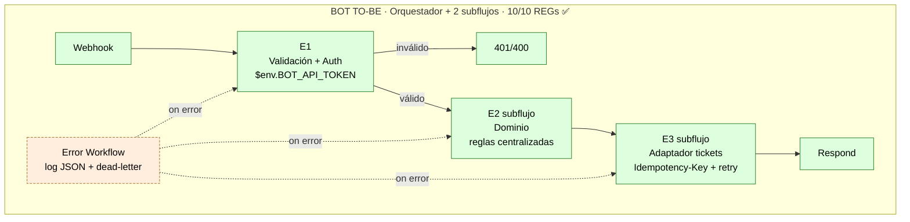
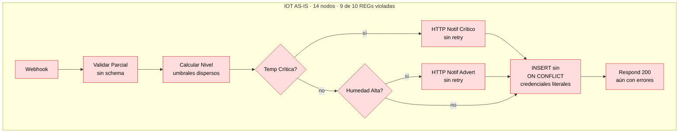
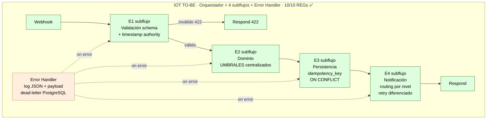
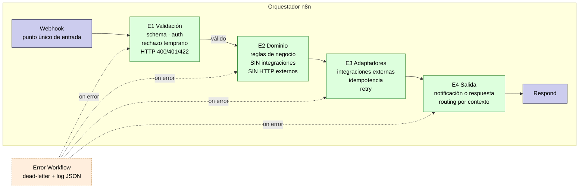

> 🌐 **Idioma / Language:** Español · [English](diagrama-comparativo.en.md)

# Diagramas Comparativos as-is vs to-be — Fuente Mermaid

**Versión:** 1.0
**Fecha:** 2026-05-07
**Propósito:** Código fuente Mermaid de los diagramas comparativos que se incluyen en el PDF resumen ejecutivo y en las diapositivas del video. Render PNG generable desde https://mermaid.live o con `mmdc` CLI.

---

## 1. Diagrama 1 — Caso Bot · As-is vs To-be

### As-is Bot (16 nodos, antipatrones visibles)

```mermaid
flowchart LR
  subgraph AS_IS_BOT["BOT AS-IS · 16 nodos · 9 de 10 REGs violadas"]
    direction LR
    W1[Webhook]:::antipat --> V1[Validar Payload<br/>token hardcoded]:::antipat
    V1 --> RL[Rate Limit<br/>en memoria]:::antipat
    RL --> CK[Check Token<br/>literal en código]:::antipat
    CK --> PM[Procesar Mensaje<br/>negocio + integración]:::antipat
    PM --> CP[Calcular Prioridad<br/>lógica dispersa]:::antipat
    CP --> H1[HTTP Tickets<br/>api-key hardcoded]:::antipat
    H1 --> PR[Parse Respuesta<br/>sin manejo error]:::antipat
    PR --> H2[HTTP Notif<br/>sin retry]:::antipat
    H2 --> SR[Set Respuesta]:::antipat
    SR --> R1[Respond]:::antipat
  end
  classDef antipat fill:#fdd,stroke:#c33,stroke-width:1px,color:#000
```



### To-be Bot (orquestador + 2 subflujos, 10/10 REGs)



### Comparación lado a lado (texto narrado en el PDF)

```
AS-IS (anti):  webhook → 16 nodos lineales con antipatrones → respond
                       (token hardcoded, sin retry, sin idempotencia,
                        sin error workflow, lógica mezclada)

TO-BE (clean): webhook → E1 → [E2 subflujo] → [E3 subflujo] → respond
                       └─→ Error workflow (log JSON + dead-letter)

Mejoras medidas:
  • Impacto CR:    5.3 nodos → 1.0 nodo       (−81 %)
  • Tiempo CR:     32.7 min → 6.7 min         (−79 %)
  • Fallos:        9 % → 6 %                  (−36.6 %)
  • MTTD:          5-10 min → ~14 s
  • Secretos:      4 literales → 0
```

---

## 2. Diagrama 2 — Caso IoT · As-is vs To-be

### As-is IoT (14 nodos, antipatrones visibles)



### To-be IoT (orquestador + 4 subflujos + error handler, 10/10 REGs)



### Comparación lado a lado IoT

```
AS-IS (anti):  webhook → 14 nodos · sin schema · sin idempotencia ·
                          umbrales dispersos · credenciales literales ·
                          respond 200 incluso con errores

TO-BE (clean): webhook → E1 → E2 → E3 → E4 → respond
                          └─→ Error handler con dead-letter PostgreSQL

Mejoras medidas:
  • Impacto CR:    4.3 nodos → 0.7 nodos      (−84 %)
  • Tiempo CR:     28.0 min → 5.2 min         (−81 %)
  • Cumplimiento:  6/7 violadas → 10/10 ✅
  • Secretos:      múltiples → 0
  • MTTD:          5-10 min → ~14 s (estructural)
  
Trade-off cuantificado (TP-GLOBAL-01):
  • Latencia p50 Set A:  78 ms → 171 ms      (+119 %)
  • Latencia p50 Set B:  78 ms → 182 ms      (+134 %)
  • Decisión: aceptado, ADR-001 IoT prioriza mantenibilidad
```

---

## 3. Diagrama 3 — Metamodelo E1–E4 (genérico para cualquier flujo n8n)



**Convenciones aplicadas en el metamodelo:**
- E1 nunca habla con servicios externos
- E2 nunca habla con servicios externos (solo lógica pura)
- E3 es la única capa que ejecuta integraciones HTTP, BD, queues
- E4 produce salida (respuesta al webhook o notificación a un canal)
- Error workflow se dispara automáticamente ante cualquier excepción
- Cada etapa emite exactamente un log JSON por ejecución

---

## 4. Diagrama 4 — Mapeo escenarios ATAM × approaches

(Diagrama complementario opcional para diapositiva del bloque 5 del video.)

```mermaid
flowchart TB
  subgraph SC["12 Escenarios ATAM top-K"]
    direction TB
    BQ1[BOT-Q1<br/>Modificabilidad reglas]
    BQ2[BOT-Q2<br/>Cambio proveedor]
    BQ3[BOT-Q3<br/>Confidencialidad]
    BQ4[BOT-Q4<br/>Integridad reintentos]
    BQ5[BOT-Q5<br/>MTTD diagnóstico]
    BQ6[BOT-Q6<br/>Contratos HTTP]
    IQ1[IOT-Q1<br/>Ajuste umbrales]
    IQ2[IOT-Q2<br/>Canal alerta]
    IQ3[IOT-Q3<br/>Integridad lecturas]
    IQ4[IOT-Q4<br/>Tolerancia fallos red]
    IQ5[IOT-Q5<br/>Urgencia diferenciada]
    IQ6[IOT-Q6<br/>Confidencialidad BD]
  end
  subgraph AP["12 Approaches arquitectónicos"]
    direction TB
    A01[AP-01 Separación E1-E4]
    A04[AP-04 Retry]
    A05[AP-05 Idempotencia]
    A06[AP-06 Error workflow]
    A07[AP-07 Log estructurado]
    A09[AP-09 Routing diferenciado]
    A11[AP-11 Validador estático]
  end
  BQ1 --> A01
  BQ2 --> A01
  BQ3 --> A11
  BQ4 --> A05
  BQ5 --> A07
  BQ6 --> A07
  IQ1 --> A01
  IQ2 --> A01
  IQ3 --> A05
  IQ4 --> A06
  IQ4 --> A04
  IQ5 --> A09
  IQ6 --> A11
```



---

## 5. Renderizado para PDF y diapositivas

### Render directo con Mermaid Live Editor

1. Copiar el bloque ```` ```mermaid ... ``` ```` deseado
2. Pegar en https://mermaid.live
3. Ajustar tema (recomendado: "default" o "neutral" para PDF impreso)
4. Exportar como PNG en alta resolución (ancho ≥ 1600 px)
5. Guardar como `atam/material-apoyo/diagrama-{N}-{nombre}.png`

### Render con CLI mmdc (mermaid-cli)

```bash
# Instalación una vez
npm install -g @mermaid-js/mermaid-cli

# Render de un diagrama específico (extraer el bloque mermaid a archivo .mmd primero)
mmdc -i diagrama-bot-asis.mmd -o diagrama-bot-asis.png -w 1920 -H 1080 -b transparent
```

### Configuración recomendada para impresión

- Ancho mínimo: 1600 px (para PDF a 4 páginas)
- Fondo: transparente o blanco
- Tema: `default` (alto contraste para imprimir)
- Tamaño de letra mínimo legible: 12 pt
