> 🌐 **Language / Idioma:** English · [Español](diagrama-as-is.md)

# Architecture diagram — Bot as-is

**Version:** 1.0
**Date:** 2026-05-01
**Purpose:** Visualize the as-is flow and annotate the REG-* antipatterns visible per node.

> **Note:** The Mermaid diagram can be exported to drawio or PNG from the draw.io UI
> (File → Import → Mermaid) and saved as `diagrama-as-is.drawio` and
> `diagrama-as-is.png` in this same folder.

---

## Main flow

```mermaid
flowchart TD
    WH["🔗 Webhook\n/bot-soporte\n[Trigger]"]
    VT["🔐 Verificar Token\n[Code node]\n⚠️ REG-001: hardcoded token\n⚠️ REG-009: always 200"]
    VRL["⏱️ Verificar Rate Limit\n[Code node]\n⚠️ REG-002: in-memory state\n⚠️ REG-006: no structured log"]
    VM["📝 Verificar Mensaje\n[Code node]\n⚠️ REG-009: no 400 if message empty"]
    OH["📋 Obtener Historial Usuario\n[HTTP Request]\n⚠️ REG-004: no retry\n⚠️ REG-008: integration in orchestrator"]
    CM["🧠 Clasificar Mensaje\n[Code node]\n⚠️ REG-007: logic + IO in the same node\n⚠️ REG-006: no structured log"]
    AP["🏷️ Asignar Prioridad\n[Code node]\n⚠️ REG-007: hardcoded in-node rules"]
    RD["💾 Registrar Interaccion DB\n[Postgres]\n⚠️ REG-005: INSERT with no ON CONFLICT\n⚠️ REG-001: hardcoded credentials"]
    CT["🎫 Crear Ticket Externo\n[HTTP Request]\n⚠️ REG-004: no retry\n⚠️ REG-005: no idempotency\n⚠️ REG-001: hardcoded API key"]
    NS["🔔 Notificar Supervisor\n[HTTP Request]\n⚠️ REG-004: no retry"]
    AE["📊 Actualizar Estadisticas\n[Code node]\n⚠️ REG-002: shared in-memory state"]
    LA["📝 Log Actividad\n[Code node]\n⚠️ REG-002: no run_id\n⚠️ REG-006: log with no structured JSON"]
    RS["✅ Respond 200\n[Respond to Webhook]\n⚠️ REG-009: always 200 OK\nEven on invalid token"]

    WH --> VT
    VT --> VRL
    VRL --> VM
    VM --> OH
    OH --> CM
    CM --> AP
    AP --> RD
    RD --> CT
    CT --> NS
    NS --> AE
    AE --> LA
    LA --> RS
```

---

## Antipatterns visible per node

| Node | Antipattern | Violated REG | Impact |
|------|-----------|-------------|---------|
| Verificar Token | Hardcoded token as a literal in the Code node | REG-001 | Secret exposed in the exported JSON |
| Verificar Token | Responds 200 even with an invalid token | REG-009 | Broken HTTP contract — client cannot distinguish the error |
| Verificar Rate Limit | Rate-limit state in `$getWorkflowStaticData` (in-memory) | REG-002 | Counter lost on n8n restart; not deterministic |
| Verificar Rate Limit | No structured JSON log | REG-006 | MTTD not computable on failure |
| Verificar Mensaje | No 400/422 for an empty or overly long message | REG-009 | Silent validation errors |
| Obtener Historial | HTTP Request with no retry | REG-004 | A single timeout → lost history |
| Obtener Historial | HTTP integration in the orchestrator, not in E3 | REG-008 | Domain/adapter coupling |
| Clasificar Mensaje | Business logic mixed with reading external history | REG-007 | High change impact: modifying a rule touches the whole node |
| Clasificar Mensaje | No structured JSON log | REG-006 | Classification untraceable without opening the n8n history |
| Asignar Prioridad | Priority rules hardcoded in scattered IF conditions | REG-007 | CR1 (changing priority) requires editing multiple nodes |
| Registrar Interaccion DB | INSERT with no ON CONFLICT | REG-005 | Retries create duplicate records |
| Registrar Interaccion DB | Hardcoded PG credentials (commented out in the measurement version) | REG-001 | Secret in the exported JSON |
| Crear Ticket Externo | HTTP Request with no retry | REG-004 | Ticket lost on transient failure |
| Crear Ticket Externo | No idempotency key | REG-005 | Retry creates a duplicate ticket |
| Crear Ticket Externo | Hardcoded API key | REG-001 | Secret exposed in the exported JSON |
| Notificar Supervisor | HTTP Request with no retry | REG-004 | Notification lost on transient failure |
| Actualizar Estadisticas | Non-persisted in-memory counter | REG-002 | Non-distributed state, lost between sessions |
| Log Actividad | No run_id | REG-002 | Logs not correlatable across executions |
| Log Actividad | Plain-text log, not structured JSON | REG-006 | MTTD computable only by opening the n8n history |
| Respond 200 | Always responds 200, even with an invalid token | REG-009 | Critical HTTP contract antipattern |

---

## Violation summary

| REG | # of nodes violating it | Severity |
|-----|--------------------------|-----------|
| REG-001 | 3 nodes (token, DB, API key) | High — secrets in the repository |
| REG-002 | 3 nodes (rate-limit, statistics, log) | High — non-deterministic state |
| REG-004 | 3 nodes (history, ticket, notification) | High — losable data |
| REG-005 | 2 nodes (DB, external ticket) | High — silent duplicates |
| REG-006 | 2 nodes (rate-limit, activity log) | Medium — blind diagnosis |
| REG-007 | 2 nodes (classify, priority) | High — high change impact |
| REG-008 | 1 node (history in the orchestrator) | Medium — coupling |
| REG-009 | 2 nodes (token, respond) | High — broken HTTP contract |

**No node meets REG-003** (errorWorkflow not configured in the flow).
**No node meets REG-010** (ADRs added in PHASE 3, not in the original flow).
