# Diagrama arquitectónico — Bot as-is

**Versión:** 1.0
**Fecha:** 2026-05-01
**Propósito:** Visualizar el flujo as-is y anotar los antipatrones REG-* visibles por nodo.

> **Nota:** El diagrama Mermaid puede exportarse a drawio o PNG desde la UI de draw.io
> (File → Import → Mermaid) y guardarse como `diagrama-as-is.drawio` y
> `diagrama-as-is.png` en esta misma carpeta.

---

## Flujo principal

```mermaid
flowchart TD
    WH["🔗 Webhook\n/bot-soporte\n[Trigger]"]
    VT["🔐 Verificar Token\n[Code node]\n⚠️ REG-001: token hardcodeado\n⚠️ REG-009: siempre 200"]
    VRL["⏱️ Verificar Rate Limit\n[Code node]\n⚠️ REG-002: estado in-memory\n⚠️ REG-006: sin log estructurado"]
    VM["📝 Verificar Mensaje\n[Code node]\n⚠️ REG-009: sin 400 si mensaje vacío"]
    OH["📋 Obtener Historial Usuario\n[HTTP Request]\n⚠️ REG-004: sin retry\n⚠️ REG-008: integración en orquestador"]
    CM["🧠 Clasificar Mensaje\n[Code node]\n⚠️ REG-007: lógica + IO en mismo nodo\n⚠️ REG-006: sin log estructurado"]
    AP["🏷️ Asignar Prioridad\n[Code node]\n⚠️ REG-007: reglas hardcodeadas in-node"]
    RD["💾 Registrar Interaccion DB\n[Postgres]\n⚠️ REG-005: INSERT sin ON CONFLICT\n⚠️ REG-001: credenciales hardcodeadas"]
    CT["🎫 Crear Ticket Externo\n[HTTP Request]\n⚠️ REG-004: sin retry\n⚠️ REG-005: sin idempotencia\n⚠️ REG-001: API key hardcodeada"]
    NS["🔔 Notificar Supervisor\n[HTTP Request]\n⚠️ REG-004: sin retry"]
    AE["📊 Actualizar Estadisticas\n[Code node]\n⚠️ REG-002: estado in-memory compartido"]
    LA["📝 Log Actividad\n[Code node]\n⚠️ REG-002: sin run_id\n⚠️ REG-006: log sin JSON estructurado"]
    RS["✅ Respond 200\n[Respond to Webhook]\n⚠️ REG-009: siempre 200 OK\nIncluso en token inválido"]

    WH --> VT
    VT --> VRL
    VRL --> VM
    VM --> OH
    OH --> CM
    CM --> AP
    AP --> RD
    RD --> CT
    CT --> NS
    NS --> AE
    AE --> LA
    LA --> RS
```

---

## Antipatrones visibles por nodo

| Nodo | Antipatrón | REG violada | Impacto |
|------|-----------|-------------|---------|
| Verificar Token | Token hardcodeado como literal en Code node | REG-001 | Secreto expuesto en JSON exportado |
| Verificar Token | Responde 200 incluso con token inválido | REG-009 | Contrato HTTP roto — cliente no puede distinguir error |
| Verificar Rate Limit | Estado de rate-limit en `$getWorkflowStaticData` (in-memory) | REG-002 | Contador se pierde al reiniciar n8n; no es determinístico |
| Verificar Rate Limit | Sin log estructurado JSON | REG-006 | No calculable MTTD si falla |
| Verificar Mensaje | Sin 400/422 para mensaje vacío o demasiado largo | REG-009 | Errores de validación silenciosos |
| Obtener Historial | HTTP Request sin retry | REG-004 | Timeout único → historial perdido |
| Obtener Historial | Integración HTTP en orquestador, no en E3 | REG-008 | Acoplamiento dominio/adaptador |
| Clasificar Mensaje | Lógica de negocio mezclada con lectura de historial externo | REG-007 | Impacto de cambio alto: modificar regla toca todo el nodo |
| Clasificar Mensaje | Sin log estructurado JSON | REG-006 | Clasificación no trazable sin abrir historial n8n |
| Asignar Prioridad | Reglas de prioridad hardcodeadas en condiciones IF dispersas | REG-007 | CR1 (cambiar prioridad) requiere editar múltiples nodos |
| Registrar Interaccion DB | INSERT sin ON CONFLICT | REG-005 | Reintentos crean registros duplicados |
| Registrar Interaccion DB | Credenciales PG hardcodeadas (comentadas en versión medición) | REG-001 | Secreto en JSON exportado |
| Crear Ticket Externo | HTTP Request sin retry | REG-004 | Ticket perdido en fallo transitorio |
| Crear Ticket Externo | Sin clave de idempotencia | REG-005 | Reintento crea ticket duplicado |
| Crear Ticket Externo | API key hardcodeada | REG-001 | Secreto expuesto en JSON exportado |
| Notificar Supervisor | HTTP Request sin retry | REG-004 | Notificación perdida en fallo transitorio |
| Actualizar Estadisticas | Contador in-memory no persistido | REG-002 | Estado no distribuido, se pierde entre sesiones |
| Log Actividad | Sin run_id | REG-002 | Logs no correlacionables entre ejecuciones |
| Log Actividad | Log en texto plano, no JSON estructurado | REG-006 | MTTD calculable solo abriendo historial n8n |
| Respond 200 | Siempre responde 200, incluso con token inválido | REG-009 | Antipatrón crítico de contrato HTTP |

---

## Resumen de violaciones

| REG | # de nodos que la violan | Severidad |
|-----|--------------------------|-----------|
| REG-001 | 3 nodos (token, DB, API key) | Alta — secretos en repositorio |
| REG-002 | 3 nodos (rate-limit, estadísticas, log) | Alta — estado no determinístico |
| REG-004 | 3 nodos (historial, ticket, notificación) | Alta — datos perdibles |
| REG-005 | 2 nodos (DB, ticket externo) | Alta — duplicados silenciosos |
| REG-006 | 2 nodos (rate-limit, log actividad) | Media — diagnóstico ciego |
| REG-007 | 2 nodos (clasificar, prioridad) | Alta — impacto de cambio alto |
| REG-008 | 1 nodo (historial en orquestador) | Media — acoplamiento |
| REG-009 | 2 nodos (token, respond) | Alta — contrato HTTP roto |

**Ningún nodo cumple REG-003** (errorWorkflow no configurado en el flujo).
**Ningún nodo cumple REG-010** (ADRs añadidos en FASE 3, no en el flujo original).
