> 🌐 **Language / Idioma:** English · [Español](diagrama-as-is.md)

# Architecture diagram — IoT as-is

**Version:** 1.0
**Date:** 2026-05-01
**Purpose:** Visualize the IoT pipeline's as-is flow and annotate the REG-* antipatterns
visible per node.

> **Note:** The Mermaid diagram can be exported to drawio or PNG from the draw.io UI
> (File → Import → Mermaid) and saved as `diagrama-as-is.drawio` and
> `diagrama-as-is.png` in this same folder.

---

## Main flow

```mermaid
flowchart TD
    WH["🔗 Webhook\n/iot-sensor\n[Trigger]"]
    VC["🔍 Validar Campos\n[Code node]\n⚠️ REG-009: responds 200 on error\n⚠️ REG-006: no structured log"]
    VT["📐 Validar Tipos\n[Code node]\n⚠️ REG-009: no 422 for invalid types"]
    TC["🌡️ Temp Critica?\n[IF node]\n⚠️ REG-007: hardcoded threshold (35°C)"]
    HA["💧 Humedad Alta?\n[IF node]\n⚠️ REG-007: hardcoded threshold (80%)"]
    DC["💨 Determinar Nivel CO2\n[Code node]\n⚠️ REG-007: logic + IO mixed\n⚠️ REG-008: integration in a domain node"]
    EN["🔧 Enriquecer Datos\n[Code node]\n⚠️ REG-001: hardcoded PG credentials\n⚠️ REG-007: hardcoded CO2 threshold"]
    PP["📦 Preparar Payload\n[Code node]\n⚠️ REG-002: no run_id generated"]
    PS["💾 Persistir PostgreSQL\n[Postgres]\n⚠️ REG-005: INSERT with no ON CONFLICT\n⚠️ REG-004: no retry"]
    PA["📋 Persistir Auditoria\n[Postgres]\n⚠️ REG-005: INSERT with no ON CONFLICT\n⚠️ REG-004: no retry"]
    NN["❓ Nivel != Normal?\n[IF node]\n⚠️ REG-007: logic in a routing node"]
    NE["🔔 Notificar Evento\n[HTTP Request]\n⚠️ REG-004: no retry\n⚠️ REG-008: single channel with no routing"]
    LF["📝 Log Final\n[Code node]\n⚠️ REG-002: no run_id\n⚠️ REG-006: log with no structured JSON"]
    RS["✅ Respond 200\n[Respond to Webhook]\n⚠️ REG-009: always 200 OK\nEven if validation fails"]

    WH --> VC
    VC --> VT
    VT --> TC
    TC -- "Yes (>35°C)" --> DC
    TC -- "No" --> HA
    HA -- "Yes (>80%)" --> DC
    HA -- "No" --> DC
    DC --> EN
    EN --> PP
    PP --> PS
    PS --> PA
    PA --> NN
    NN -- "Yes" --> NE
    NN -- "No" --> LF
    NE --> LF
    LF --> RS
```

---

## Antipatterns visible per node

| Node | Antipattern | Violated REG | Impact |
|------|-----------|-------------|---------|
| Validar Campos | Responds 200 on a validation error | REG-009 | The client cannot distinguish success from failure |
| Validar Campos | No structured JSON log | REG-006 | Validation errors invisible in logs |
| Validar Tipos | No 422 for invalid types | REG-009 | Incorrect HTTP contract |
| Temp Crítica? | Hardcoded 35°C threshold in the IF node | REG-007 | CR1 (changing the threshold) requires editing the IF node |
| Humedad Alta? | Hardcoded 80% threshold in the IF node | REG-007 | Thresholds scattered across multiple nodes |
| Determinar Nivel CO2 | Domain logic mixed with integration data transformation | REG-007, REG-008 | Domain/adapter coupling |
| Enriquecer Datos | PostgreSQL credentials hardcoded as literal values | REG-001 | Secret in the exported JSON (fixed in the measurement version) |
| Enriquecer Datos | CO2 threshold (1000 ppm) hardcoded outside the thresholds module | REG-007 | Duplicate threshold — CR1 requires editing multiple nodes |
| Preparar Payload | No run_id generation | REG-002 | Logs not correlatable across executions |
| Persistir PostgreSQL | INSERT with no ON CONFLICT | REG-005 | Retry silently creates duplicate readings |
| Persistir PostgreSQL | No retry configured | REG-004 | A single timeout → reading permanently lost |
| Persistir Auditoría | INSERT with no ON CONFLICT | REG-005 | Duplicates in the audit table |
| Persistir Auditoría | No retry configured | REG-004 | Unreliable audit on transient failures |
| Nivel != Normal? | Routing in a node separate from the domain — no traceability to E2 | REG-007 | Decision logic scattered |
| Notificar Evento | HTTP Request with no retry | REG-004 | Critical notification lost on transient failure |
| Notificar Evento | Single channel — no critical vs warning differentiation | REG-008 | Urgencies not operationally differentiated |
| Log Final | No run_id | REG-002 | Logs not correlatable |
| Log Final | Plain-text log, not structured JSON | REG-006 | MTTD computable only by opening the n8n history |
| Respond 200 | Always 200 even if the reading was invalid | REG-009 | The sensor doesn't know if its data was rejected |

---

## Violation summary

| REG | # of nodes violating it | Severity |
|-----|--------------------------|-----------|
| REG-001 | 1 node (PG credentials) | High — secret in the repository |
| REG-002 | 2 nodes (prepare payload, final log) | High — no log correlation |
| REG-004 | 3 nodes (persistence × 2, notification) | High — losable data and alerts |
| REG-005 | 2 nodes (readings, audit) | High — DB duplicates |
| REG-006 | 2 nodes (validate fields, final log) | Medium — blind diagnosis |
| REG-007 | 4 nodes (temp, humidity, co2, enrich) | High — scattered thresholds, costly CR1 |
| REG-008 | 1 node (notification with no routing) | Medium — single channel |
| REG-009 | 2 nodes (validate fields, respond) | High — broken HTTP contract |

**No node meets REG-003** (errorWorkflow not configured).
**No node meets REG-010** (ADRs added in PHASE 3, not in the original flow).
