# Diagrama arquitectónico — IoT as-is

**Versión:** 1.0
**Fecha:** 2026-05-01
**Propósito:** Visualizar el flujo as-is del pipeline IoT y anotar los antipatrones REG-* visibles por nodo.

> **Nota:** El diagrama Mermaid puede exportarse a drawio o PNG desde la UI de draw.io
> (File → Import → Mermaid) y guardarse como `diagrama-as-is.drawio` y
> `diagrama-as-is.png` en esta misma carpeta.

---

## Flujo principal

```mermaid
flowchart TD
    WH["🔗 Webhook\n/iot-sensor\n[Trigger]"]
    VC["🔍 Validar Campos\n[Code node]\n⚠️ REG-009: responde 200 en error\n⚠️ REG-006: sin log estructurado"]
    VT["📐 Validar Tipos\n[Code node]\n⚠️ REG-009: sin 422 por tipos inválidos"]
    TC["🌡️ Temp Critica?\n[IF node]\n⚠️ REG-007: umbral hardcodeado (35°C)"]
    HA["💧 Humedad Alta?\n[IF node]\n⚠️ REG-007: umbral hardcodeado (80%)"]
    DC["💨 Determinar Nivel CO2\n[Code node]\n⚠️ REG-007: lógica + IO mezclados\n⚠️ REG-008: integración en nodo de dominio"]
    EN["🔧 Enriquecer Datos\n[Code node]\n⚠️ REG-001: credenciales PG hardcodeadas\n⚠️ REG-007: umbral CO2 hardcodeado"]
    PP["📦 Preparar Payload\n[Code node]\n⚠️ REG-002: sin run_id generado"]
    PS["💾 Persistir PostgreSQL\n[Postgres]\n⚠️ REG-005: INSERT sin ON CONFLICT\n⚠️ REG-004: sin retry"]
    PA["📋 Persistir Auditoria\n[Postgres]\n⚠️ REG-005: INSERT sin ON CONFLICT\n⚠️ REG-004: sin retry"]
    NN["❓ Nivel != Normal?\n[IF node]\n⚠️ REG-007: lógica en nodo de routing"]
    NE["🔔 Notificar Evento\n[HTTP Request]\n⚠️ REG-004: sin retry\n⚠️ REG-008: canal único sin routing"]
    LF["📝 Log Final\n[Code node]\n⚠️ REG-002: sin run_id\n⚠️ REG-006: log sin JSON estructurado"]
    RS["✅ Respond 200\n[Respond to Webhook]\n⚠️ REG-009: siempre 200 OK\nIncluso si validación falla"]

    WH --> VC
    VC --> VT
    VT --> TC
    TC -- "Sí (>35°C)" --> DC
    TC -- "No" --> HA
    HA -- "Sí (>80%)" --> DC
    HA -- "No" --> DC
    DC --> EN
    EN --> PP
    PP --> PS
    PS --> PA
    PA --> NN
    NN -- "Sí" --> NE
    NN -- "No" --> LF
    NE --> LF
    LF --> RS
```

---

## Antipatrones visibles por nodo

| Nodo | Antipatrón | REG violada | Impacto |
|------|-----------|-------------|---------|
| Validar Campos | Responde 200 en error de validación | REG-009 | El cliente no puede distinguir éxito de fallo |
| Validar Campos | Sin log estructurado JSON | REG-006 | Errores de validación invisibles en logs |
| Validar Tipos | Sin 422 para tipos inválidos | REG-009 | Contrato HTTP incorrecto |
| Temp Crítica? | Umbral 35°C hardcodeado en nodo IF | REG-007 | CR1 (cambiar umbral) requiere editar nodo IF |
| Humedad Alta? | Umbral 80% hardcodeado en nodo IF | REG-007 | Umbrales dispersos en múltiples nodos |
| Determinar Nivel CO2 | Lógica de dominio mezclada con transformación de datos de integración | REG-007, REG-008 | Acoplamiento dominio/adaptador |
| Enriquecer Datos | Credenciales PostgreSQL hardcodeadas como valores literales | REG-001 | Secreto en JSON exportado (corregido en versión medición) |
| Enriquecer Datos | Umbral CO2 (1000 ppm) hardcodeado fuera del módulo de umbrales | REG-007 | Umbral duplicado — CR1 requiere editar múltiples nodos |
| Preparar Payload | Sin generación de run_id | REG-002 | Logs no correlacionables entre ejecuciones |
| Persistir PostgreSQL | INSERT sin ON CONFLICT | REG-005 | Reintento crea lecturas duplicadas silenciosamente |
| Persistir PostgreSQL | Sin retry configurado | REG-004 | Timeout único → lectura perdida definitivamente |
| Persistir Auditoría | INSERT sin ON CONFLICT | REG-005 | Duplicados en tabla de auditoría |
| Persistir Auditoría | Sin retry configurado | REG-004 | Auditoría no confiable en fallos transitorios |
| Nivel != Normal? | Routing en nodo separado del dominio — sin trazabilidad al E2 | REG-007 | Lógica de decisión dispersa |
| Notificar Evento | HTTP Request sin retry | REG-004 | Notificación crítica perdida en fallo transitorio |
| Notificar Evento | Canal único — sin diferenciación crítico vs advertencia | REG-008 | Urgencias no diferenciadas operativamente |
| Log Final | Sin run_id | REG-002 | Logs no correlacionables |
| Log Final | Log en texto plano, no JSON estructurado | REG-006 | MTTD solo calculable abriendo historial n8n |
| Respond 200 | Siempre 200 incluso si la lectura era inválida | REG-009 | El sensor no sabe si su dato fue rechazado |

---

## Resumen de violaciones

| REG | # de nodos que la violan | Severidad |
|-----|--------------------------|-----------|
| REG-001 | 1 nodo (credenciales PG) | Alta — secreto en repositorio |
| REG-002 | 2 nodos (preparar payload, log final) | Alta — sin correlación de logs |
| REG-004 | 3 nodos (persistencia × 2, notificación) | Alta — datos y alertas perdibles |
| REG-005 | 2 nodos (lecturas, auditoría) | Alta — duplicados en BD |
| REG-006 | 2 nodos (validar campos, log final) | Media — diagnóstico ciego |
| REG-007 | 4 nodos (temp, humedad, co2, enriquecer) | Alta — umbrales dispersos, CR1 costoso |
| REG-008 | 1 nodo (notificación sin routing) | Media — canal único |
| REG-009 | 2 nodos (validar campos, respond) | Alta — contrato HTTP roto |

**Ningún nodo cumple REG-003** (errorWorkflow no configurado).
**Ningún nodo cumple REG-010** (ADRs añadidos en FASE 3, no en el flujo original).
