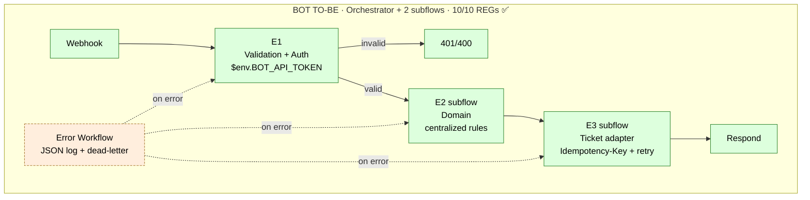
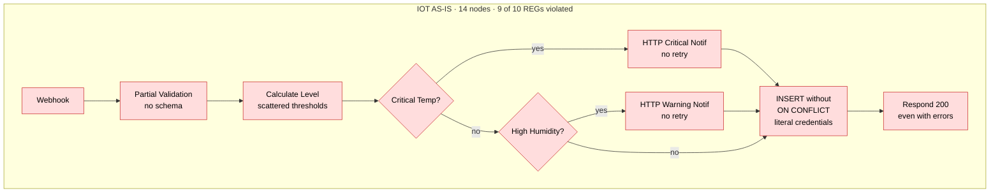
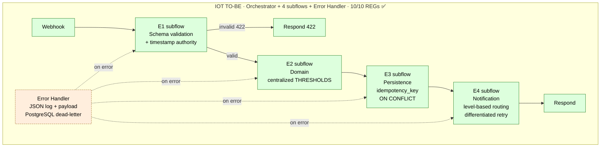
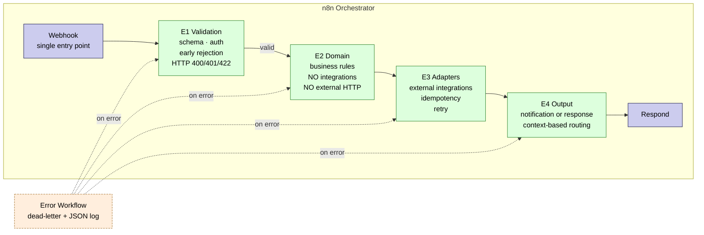
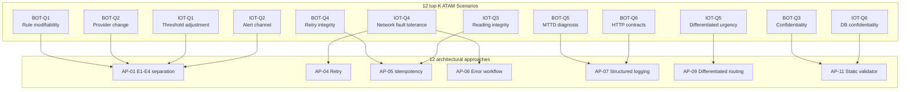

> 🌐 **Language / Idioma:** English · [Español](diagrama-comparativo.md)

# Comparative As-is vs To-be Diagrams — Mermaid Source

**Version:** 1.0
**Date:** 2026-05-07
**Purpose:** Mermaid source code for the comparative diagrams included in the executive summary PDF and in the video slides. PNG render generatable from https://mermaid.live or with the `mmdc` CLI.

---

## 1. Diagram 1 — Bot Case · As-is vs To-be

### As-is Bot (16 nodes, visible antipatterns)

```mermaid
flowchart LR
  subgraph AS_IS_BOT["BOT AS-IS · 16 nodes · 9 of 10 REGs violated"]
    direction LR
    W1[Webhook]:::antipat --> V1[Validate Payload<br/>hardcoded token]:::antipat
    V1 --> RL[Rate Limit<br/>in memory]:::antipat
    RL --> CK[Check Token<br/>literal in code]:::antipat
    CK --> PM[Process Message<br/>business + integration]:::antipat
    PM --> CP[Calculate Priority<br/>scattered logic]:::antipat
    CP --> H1[HTTP Tickets<br/>hardcoded api-key]:::antipat
    H1 --> PR[Parse Response<br/>no error handling]:::antipat
    PR --> H2[HTTP Notif<br/>no retry]:::antipat
    H2 --> SR[Set Response]:::antipat
    SR --> R1[Respond]:::antipat
  end
  classDef antipat fill:#fdd,stroke:#c33,stroke-width:1px,color:#000
```



### To-be Bot (orchestrator + 2 subflows, 10/10 REGs)



### Side-by-side comparison (narrated text in the PDF)

```
AS-IS (anti):  webhook → 16 linear nodes with antipatterns → respond
                       (hardcoded token, no retry, no idempotency,
                        no error workflow, mixed logic)

TO-BE (clean): webhook → E1 → [E2 subflow] → [E3 subflow] → respond
                       └─→ Error workflow (JSON log + dead-letter)

Measured improvements:
  • CR impact:     5.3 nodes → 1.0 node        (−81 %)
  • CR time:       32.7 min → 6.7 min          (−79 %)
  • Failures:      9 % → 6 %                   (−36.6 %)
  • MTTD:          5-10 min → ~14 s
  • Secrets:       4 literals → 0
```

---

## 2. Diagram 2 — IoT Case · As-is vs To-be

### As-is IoT (14 nodes, visible antipatterns)



### To-be IoT (orchestrator + 4 subflows + error handler, 10/10 REGs)



### Side-by-side comparison IoT

```
AS-IS (anti):  webhook → 14 nodes · no schema · no idempotency ·
                          scattered thresholds · literal credentials ·
                          respond 200 even with errors

TO-BE (clean): webhook → E1 → E2 → E3 → E4 → respond
                          └─→ Error handler with PostgreSQL dead-letter

Measured improvements:
  • CR impact:     4.3 nodes → 0.7 nodes       (−84 %)
  • CR time:       28.0 min → 5.2 min          (−81 %)
  • Compliance:    6/7 violated → 10/10 ✅
  • Secrets:       multiple → 0
  • MTTD:          5-10 min → ~14 s (structural)

Quantified trade-off (TP-GLOBAL-01):
  • Latency p50 Set A:  78 ms → 171 ms       (+119 %)
  • Latency p50 Set B:  78 ms → 182 ms       (+134 %)
  • Decision: accepted, ADR-001 IoT prioritizes maintainability
```

---

## 3. Diagram 3 — E1–E4 Metamodel (generic for any n8n flow)



**Conventions applied in the metamodel:**
- E1 never talks to external services
- E2 never talks to external services (pure logic only)
- E3 is the only layer that executes HTTP integrations, DB, queues
- E4 produces output (response to the webhook or notification to a channel)
- The error workflow triggers automatically on any exception
- Each stage emits exactly one JSON log per execution

---

## 4. Diagram 4 — ATAM scenario × approach mapping

(Optional complementary diagram for the video's block 5 slide.)



---

## 5. Rendering for PDF and slides

### Direct render with Mermaid Live Editor

1. Copy the desired ```` ```mermaid ... ``` ```` block
2. Paste into https://mermaid.live
3. Adjust theme (recommended: "default" or "neutral" for printed PDF)
4. Export as high-resolution PNG (width ≥ 1600 px)
5. Save as `docs/atam/material-apoyo/diagrama-{N}-{name}.png`

### Render with mmdc CLI (mermaid-cli)

```bash
# One-time installation
npm install -g @mermaid-js/mermaid-cli

# Render a specific diagram (extract the mermaid block to a .mmd file first)
mmdc -i diagrama-bot-asis.mmd -o diagrama-bot-asis.png -w 1920 -H 1080 -b transparent
```

### Recommended configuration for printing

- Minimum width: 1600 px (for a 4-page PDF)
- Background: transparent or white
- Theme: `default` (high contrast for printing)
- Minimum legible font size: 12 pt
