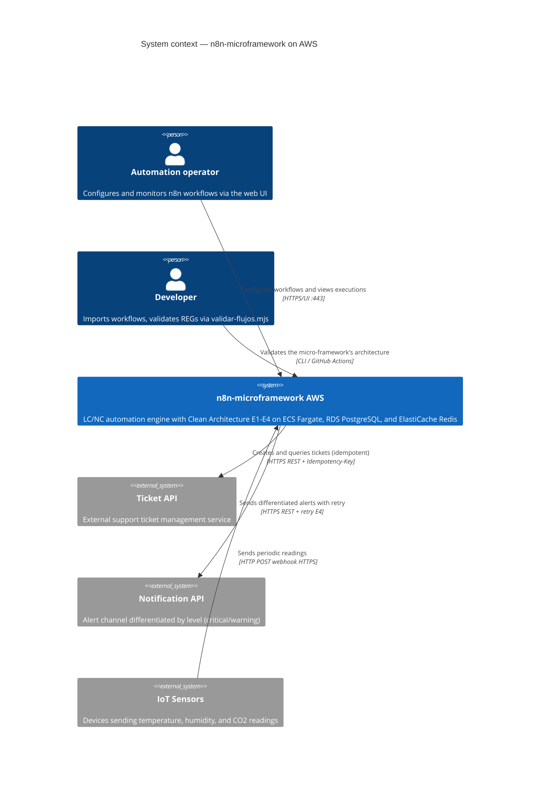
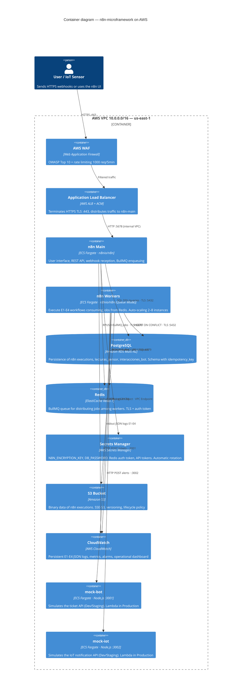
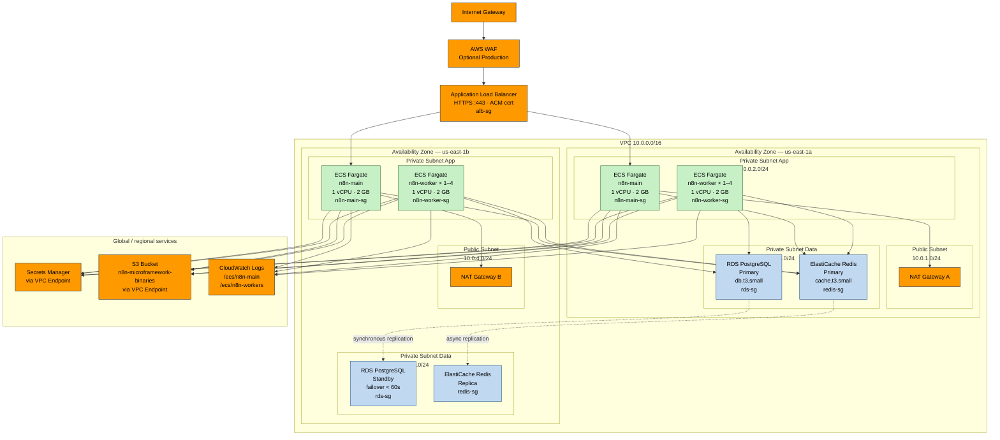
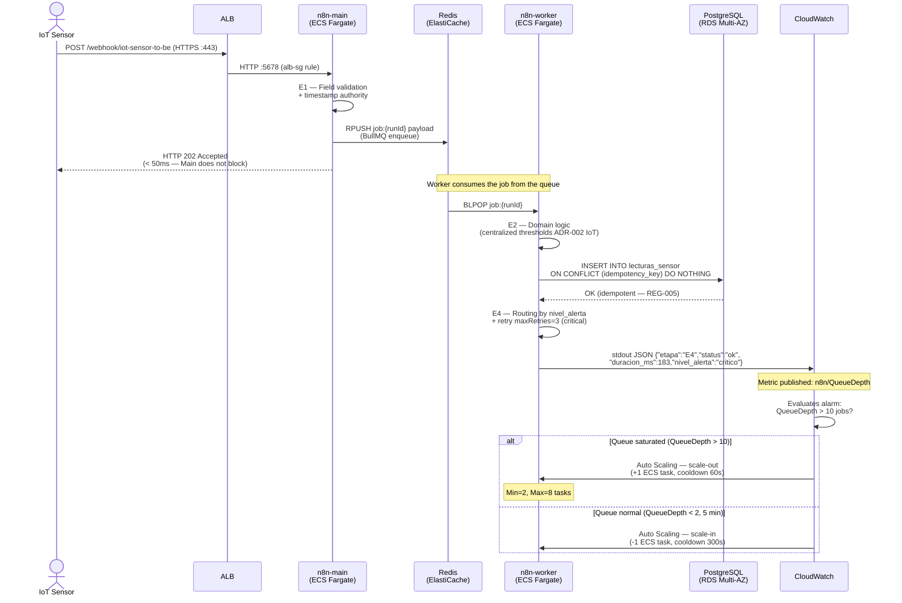
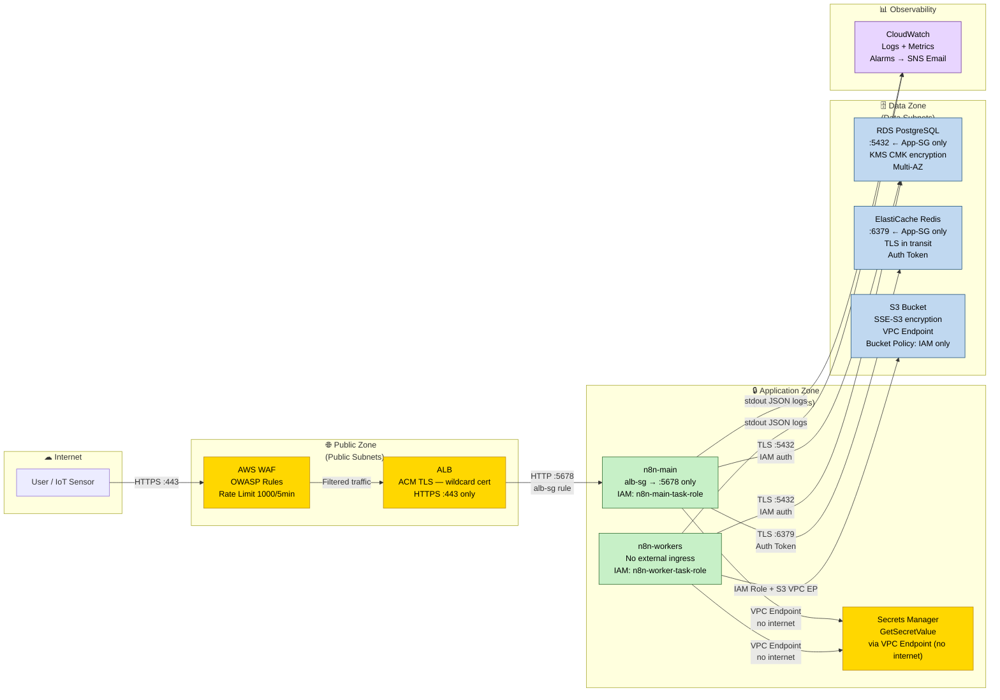
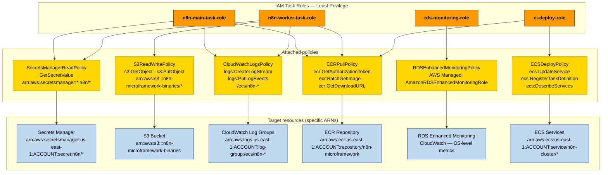

> 🌐 **Language / Idioma:** English · [Español](diagramas-aws.md)

# Mermaid Diagrams — n8n-microframework on AWS

**Version:** 1.0
**Date:** 2026-05-18
**Phase:** 8 — AWS architecture design (SO4)

This document is the canonical source for all Phase 8 Mermaid diagrams.
Each diagram includes its full source code, the selected type with academic
justification, and the instructions for rendering the final PNG image.

---

## Rendering instructions

### Option A — mermaid.live (no installation)

1. Open [https://mermaid.live](https://mermaid.live)
2. Paste the code from the corresponding Mermaid block
3. Download as PNG with the "Download PNG" button (recommended resolution: `@2x`)

### Option B — mmdc CLI (local batch rendering)

```bash
# Install Mermaid CLI
npm install -g @mermaid-js/mermaid-cli

# Render a specific diagram
mmdc -i docs/aws/diagramas-aws.md -o docs/aws/renders/diag1-contexto.png -w 1600 --cssFile "" --configFile docs/aws/mermaid-config.json

# Batch-render all diagrams (requires splitting blocks into individual files)
for i in 1 2 3 4 5 6 7; do
  mmdc -i docs/aws/diag${i}.mmd -o docs/aws/renders/diag${i}.png -w 1600
done
```

### Recommended Mermaid configuration file (`mermaid-config.json`)

```json
{
  "theme": "base",
  "themeVariables": {
    "fontSize": "16px",
    "fontFamily": "Arial, sans-serif"
  }
}
```

---

## Diagram summary

| # | Mermaid type | Main location | Purpose |
|---|---|---|---|
| 1 | `C4Context` | `arquitectura-aws.md §1` | System context — actors and external systems |
| 2 | `C4Container` | `arquitectura-aws.md §2` | AWS containers and protocols between services |
| 3 | `flowchart TD` | `arquitectura-aws.md §3` | Multi-AZ network topology with subnets and VPC |
| 4 | `sequenceDiagram` | `escalabilidad.md §1` | Temporal flow webhook → Queue Mode → RDS → Auto Scaling |
| 5 | `flowchart LR` | `seguridad-iam.md §1` | Trust zones and security controls |
| 6 | `graph TD` | `seguridad-iam.md §2` | IAM hierarchy: roles → policies → resources |
| 7 | `xychart-beta` | `estimacion-costos.md §3` | Cost comparison by component and tier |

---

## Diagram 1 — System context (C4 Level 1)

**Type:** `C4Context`
**Academic justification:** The C4 notation (Brown, 2018) is the standard for
architectural documentation in academic and software engineering contexts. Level 1
context shows WHAT interacts with the system without revealing internal
implementation details. It is the ideal entry point for the architecture chapter
in the thesis.

**Location:** Insert the rendered image in `arquitectura-aws.md` at the start of §1 (Context).



---

## Diagram 2 — AWS containers (C4 Level 2)

**Type:** `C4Container`
**Academic justification:** C4 Level 2 containers shows the deployable
processes/services and their interactions. It is the most commonly used level in
technical thesis documentation because it allows annotating each component's
technology (ECS Fargate, RDS, Redis) with the protocols and ports between services.
It corresponds to the "logical deployment view" of Kruchten's 4+1 view model.

**Location:** Insert the rendered image in `arquitectura-aws.md` at the start of §2 (Service inventory).



---

## Diagram 3 — Multi-AZ network topology

**Type:** `flowchart TD` with nested subgraphs
**Academic justification:** C4 diagrams do not model physical distribution across
availability zones (AZs) or subnet hierarchy well. The `flowchart` with subgraphs
allows representing the VPC → Subnet → AZ → Service hierarchy with visual clarity.
It is the standard type in cloud architecture documentation (AWS Well-Architected
Framework, AWS whitepapers) and references such as "Cloud Architecture Patterns"
(Wilder, 2012).

**Location:** Insert the rendered image in `arquitectura-aws.md` at the start of §3 (Network design).



---

## Diagram 4 — Execution flow in Queue Mode (Sequence)

**Type:** `sequenceDiagram`
**Academic justification:** The sequence diagram is the UML standard (ISO/IEC 19501)
for documenting ordered temporal interactions between actors and systems. It is the
most appropriate type for showing the asynchronous Queue Mode flow: the temporal
separation between receiving the webhook (n8n-main responds < 50ms) and executing
the workflow in the worker (E1-E4) is this architecture's most important behavior
and is naturally represented in sequence.

**Location:** Insert the rendered image in `escalabilidad.md` after the introductory paragraph of §1.

*(Diagram reproduced from `escalabilidad.md §1` — canonical source in that file)*



---

## Diagram 5 — Trust zones and security controls

**Type:** `flowchart LR` with zone subgraphs + classDef by color
**Academic justification:** Security "boundary diagrams" (similar to Microsoft's
STRIDE method Data Flow Diagrams) are best represented with flowchart because they
allow grouping services by trust zone and coloring the control boundaries. The
left-to-right (LR) flow reflects the natural direction of a request: Internet →
Public zone → Application zone → Data zone. This type is the most commonly used in
cloud architectural security documents (AWS Security Reference Architecture, NIST
SP 800-207 Zero Trust).

**Location:** Insert the rendered image in `seguridad-iam.md §1` after the introductory paragraph.

*(Diagram reproduced from `seguridad-iam.md §1` — canonical source in that file)*



---

## Diagram 6 — IAM hierarchy: roles → policies → resources

**Type:** `graph TD`
**Academic justification:** The IAM hierarchy (Role → Policy → Actions → Resources)
is naturally a top-down directed tree. `graph TD` (top-down) is the most legible
type for hierarchical structures with multiple levels and allows using subgraphs to
group by category. It is preferable to `flowchart` when the emphasis is on
inheritance/delegation structure rather than the temporal flow of data.

**Location:** Insert the rendered image in `seguridad-iam.md §2` after the paragraph on "Principles applied".

*(Diagram reproduced from `seguridad-iam.md §2` — canonical source in that file)*



---

## Diagram 7 — Cost estimation per tier (XY Chart)

**Type:** `xychart-beta` (bar chart)
**Academic justification:** Mermaid's `xychart-beta` allows visualizing quantitative
comparisons natively without external tools. A cost bar chart by component and tier
is more immediately legible than a text table and facilitates visual comparison
between environments. In the thesis's academic context, this diagram supports the
claim that the design is "cost-efficient" by showing the scale of costs
differentiated by tier and component.

**Location:** Insert the rendered image in `estimacion-costos.md §3` (Visual comparison by tier).

*(Diagram reproduced from `estimacion-costos.md §3` — canonical source in that file)*

```mermaid
xychart-beta
  title "Estimated monthly costs (USD) by component and tier"
  x-axis ["ECS Main", "ECS Workers", "ECS Mocks", "RDS PostgreSQL", "ElastiCache", "ALB", "NAT GW", "S3+CW+Other"]
  y-axis "USD/month" 0 --> 150
  bar [6, 6, 3, 15, 0, 0, 0, 3]
  bar [32, 65, 11, 25, 17, 10, 37, 11]
  bar [65, 130, 10, 50, 51, 23, 87, 42]
```



*Legend: the three bars per component represent Dev · Staging · Production respectively.*

---

## References

- C4 Model: Simon Brown (2018). *The C4 model for software architecture*. InfoQ.
- Mermaid Documentation: https://mermaid.js.org/intro/
- AWS Well-Architected Framework: https://docs.aws.amazon.com/wellarchitected/
- Kruchten, P. (1995). The 4+1 View Model of Architecture. IEEE Software.
- Wilder, B. (2012). *Cloud Architecture Patterns*. O'Reilly Media.
