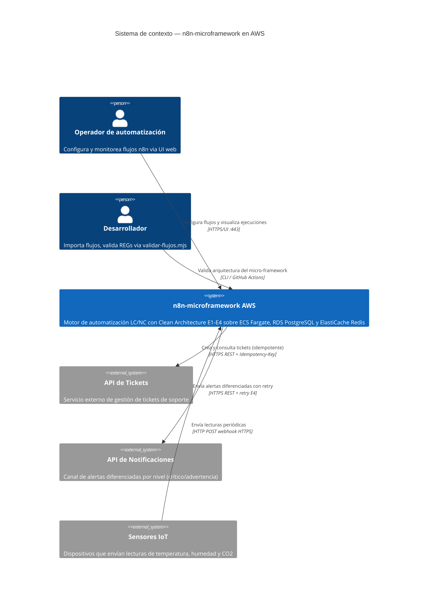
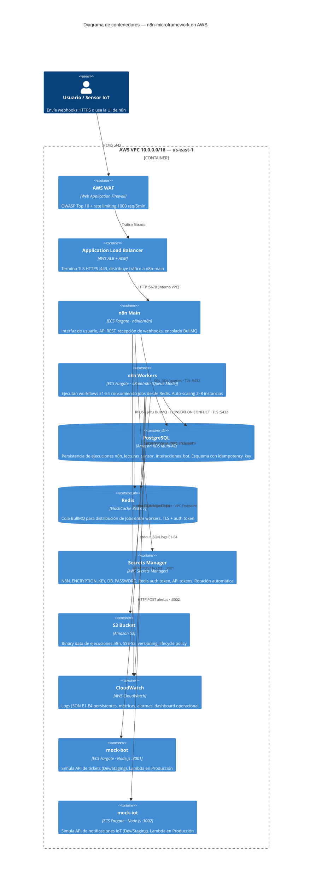
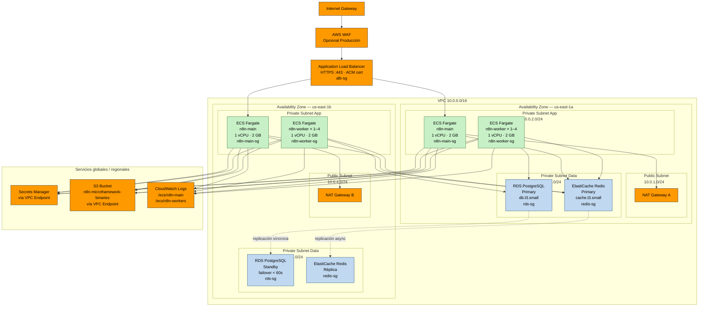
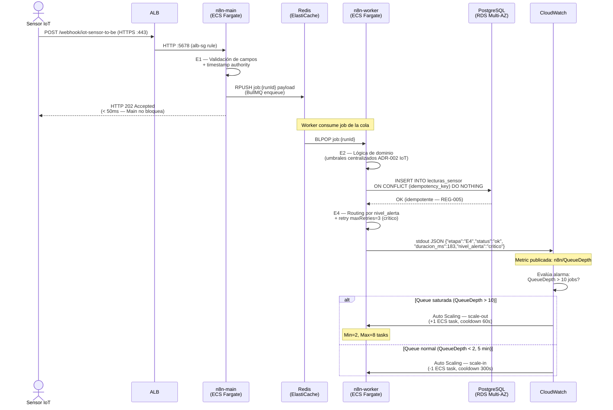
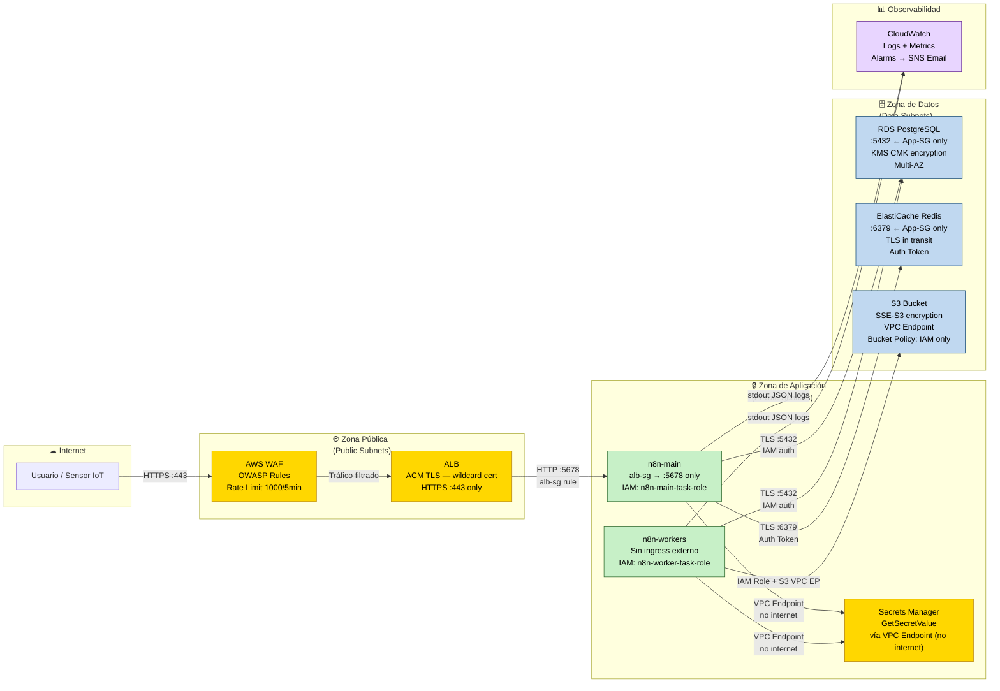
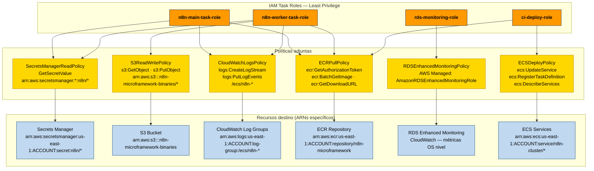

# Diagramas Mermaid — n8n-microframework en AWS

**Versión:** 1.0
**Fecha:** 2026-05-18
**Fase:** 8 — Diseño de arquitectura AWS (OE4)

Este documento es la fuente canónica de todos los diagramas Mermaid de Fase 8.
Cada diagrama incluye su código fuente completo, el tipo seleccionado con justificación
académica, y las instrucciones para renderizar la imagen PNG final.

---

## Instrucciones de renderizado

### Opción A — mermaid.live (sin instalación)

1. Abrir [https://mermaid.live](https://mermaid.live)
2. Pegar el código del bloque Mermaid correspondiente
3. Descargar como PNG con el botón "Download PNG" (resolución recomendada: `@2x`)

### Opción B — CLI mmdc (renderizado local por lotes)

```bash
# Instalar Mermaid CLI
npm install -g @mermaid-js/mermaid-cli

# Renderizar un diagrama específico
mmdc -i docs/aws/diagramas-aws.md -o docs/aws/renders/diag1-contexto.png -w 1600 --cssFile "" --configFile docs/aws/mermaid-config.json

# Renderizar todos los diagramas en lote (requiere separar bloques en archivos individuales)
for i in 1 2 3 4 5 6 7; do
  mmdc -i docs/aws/diag${i}.mmd -o docs/aws/renders/diag${i}.png -w 1600
done
```

### Archivo de configuración Mermaid recomendado (`mermaid-config.json`)

```json
{
  "theme": "base",
  "themeVariables": {
    "fontSize": "16px",
    "fontFamily": "Arial, sans-serif"
  }
}
```

---

## Resumen de diagramas

| # | Tipo Mermaid | Ubicación principal | Propósito |
|---|---|---|---|
| 1 | `C4Context` | `arquitectura-aws.md §1` | Contexto del sistema — actores y sistemas externos |
| 2 | `C4Container` | `arquitectura-aws.md §2` | Contenedores AWS y protocolos entre servicios |
| 3 | `flowchart TD` | `arquitectura-aws.md §3` | Topología de red multi-AZ con subnets y VPC |
| 4 | `sequenceDiagram` | `escalabilidad.md §1` | Flujo temporal webhook → Queue Mode → RDS → Auto Scaling |
| 5 | `flowchart LR` | `seguridad-iam.md §1` | Zonas de confianza y controles de seguridad |
| 6 | `graph TD` | `seguridad-iam.md §2` | Jerarquía IAM: roles → políticas → recursos |
| 7 | `xychart-beta` | `estimacion-costos.md §3` | Comparación de costos por componente y tier |

---

## Diagrama 1 — Contexto del sistema (C4 Level 1)

**Tipo:** `C4Context`
**Justificación académica:** La notación C4 (Brown, 2018) es el estándar para documentación
arquitectónica en contextos académicos y de ingeniería de software. El Level 1 de contexto
muestra QUÉ interactúa con el sistema sin revelar detalles de implementación interna.
Es el punto de entrada ideal para el capítulo de arquitectura en la tesis.

**Ubicación:** Insertar imagen renderizada en `arquitectura-aws.md` al inicio de §1 (Contexto).



---

## Diagrama 2 — Contenedores AWS (C4 Level 2)

**Tipo:** `C4Container`
**Justificación académica:** El Level 2 de contenedores C4 muestra los procesos/servicios
desplegables y sus interacciones. Es el nivel más usado en documentación técnica de tesis
porque permite anotar la tecnología de cada componente (ECS Fargate, RDS, Redis) con
los protocolos y puertos entre servicios. Corresponde a la "vista lógica de despliegue"
del modelo de vistas 4+1 de Kruchten.

**Ubicación:** Insertar imagen renderizada en `arquitectura-aws.md` al inicio de §2 (Inventario de servicios).



---

## Diagrama 3 — Topología de red multi-AZ

**Tipo:** `flowchart TD` con subgraphs anidados
**Justificación académica:** Los diagramas C4 no modelan bien la distribución física en
zonas de disponibilidad (AZs) ni la jerarquía de subnets. El `flowchart` con subgraphs
permite representar la jerarquía VPC → Subnet → AZ → Servicio con claridad visual.
Es el tipo estándar en documentación de arquitecturas cloud (AWS Well-Architected Framework,
whitepapers de AWS) y en referencias como "Cloud Architecture Patterns" (Wilder, 2012).

**Ubicación:** Insertar imagen renderizada en `arquitectura-aws.md` al inicio de §3 (Diseño de red).



---

## Diagrama 4 — Flujo de ejecución en Queue Mode (Sequence)

**Tipo:** `sequenceDiagram`
**Justificación académica:** El diagrama de secuencia es el estándar UML (ISO/IEC 19501)
para documentar interacciones temporales ordenadas entre actores y sistemas. Es el tipo
más apropiado para mostrar el flujo asíncrono de Queue Mode: la separación temporal entre
la recepción del webhook (n8n-main responde < 50ms) y la ejecución del workflow en el
worker (E1-E4) es el comportamiento más importante de esta arquitectura y se representa
naturalmente en secuencia.

**Ubicación:** Insertar imagen renderizada en `escalabilidad.md` después del párrafo introductorio de §1.

*(Diagrama reproducido de `escalabilidad.md §1` — fuente canónica en este archivo)*



---

## Diagrama 5 — Zonas de confianza y controles de seguridad

**Tipo:** `flowchart LR` con subgraphs de zonas + classDef por color
**Justificación académica:** Los "boundary diagrams" de seguridad (similares a los Data Flow
Diagrams del método STRIDE de Microsoft) se representan mejor con flowchart porque permiten
agrupar servicios por zona de confianza y colorear los límites de control. El flujo de
izquierda a derecha (LR) refleja la dirección natural de una request: Internet → Zona pública
→ Zona de aplicación → Zona de datos. Este tipo es el más usado en documentos de seguridad
arquitectónica cloud (AWS Security Reference Architecture, NIST SP 800-207 Zero Trust).

**Ubicación:** Insertar imagen renderizada en `seguridad-iam.md §1` después del párrafo introductorio.

*(Diagrama reproducido de `seguridad-iam.md §1` — fuente canónica en este archivo)*



---

## Diagrama 6 — Jerarquía IAM: roles → políticas → recursos

**Tipo:** `graph TD`
**Justificación académica:** La jerarquía IAM (Role → Policy → Actions → Resources) es
naturalmente un árbol dirigido de arriba hacia abajo. El `graph TD` (top-down) es el tipo
más legible para estructuras jerárquicas con múltiples niveles y permite usar subgraphs
para agrupar por categoría. Es preferible al `flowchart` cuando el énfasis está en la
estructura de herencia/delegación y no en el flujo temporal de datos.

**Ubicación:** Insertar imagen renderizada en `seguridad-iam.md §2` después del párrafo sobre "Principios aplicados".

*(Diagrama reproducido de `seguridad-iam.md §2` — fuente canónica en este archivo)*



---

## Diagrama 7 — Estimación de costos por tier (XY Chart)

**Tipo:** `xychart-beta` (bar chart)
**Justificación académica:** El `xychart-beta` de Mermaid permite visualizar comparaciones
cuantitativas de forma nativa sin herramientas externas. Un bar chart de costos por
componente y tier es más inmediatamente legible que una tabla de texto y facilita la
comparación visual entre entornos. En el contexto académico de la tesis, este diagrama
respalda la afirmación de que el diseño es "costo-eficiente" al mostrar la escala de
costos diferenciada por tier y por componente.

**Ubicación:** Insertar imagen renderizada en `estimacion-costos.md §3` (Comparación visual por tier).

*(Diagrama reproducido de `estimacion-costos.md §3` — fuente canónica en este archivo)*

```mermaid
xychart-beta
  title "Estimación de costos mensuales (USD) por componente y tier"
  x-axis ["ECS Main", "ECS Workers", "ECS Mocks", "RDS PostgreSQL", "ElastiCache", "ALB", "NAT GW", "S3+CW+Otros"]
  y-axis "USD/mes" 0 --> 150
  bar [6, 6, 3, 15, 0, 0, 0, 3]
  bar [32, 65, 11, 25, 17, 10, 37, 11]
  bar [65, 130, 10, 50, 51, 23, 87, 42]
```



*Leyenda: las tres barras por componente representan Dev · Staging · Producción respectivamente.*

---

## Referencias

- C4 Model: Simon Brown (2018). *The C4 model for software architecture*. InfoQ.
- Mermaid Documentation: https://mermaid.js.org/intro/
- AWS Well-Architected Framework: https://docs.aws.amazon.com/wellarchitected/
- Kruchten, P. (1995). The 4+1 View Model of Architecture. IEEE Software.
- Wilder, B. (2012). *Cloud Architecture Patterns*. O'Reilly Media.
