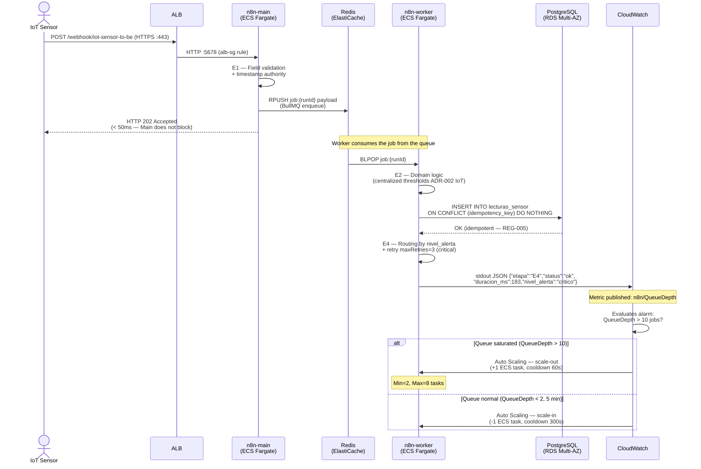

> 🌐 **Language / Idioma:** English · [Español](escalabilidad.md)

# Scalability — n8n-microframework on AWS

**Version:** 1.0
**Date:** 2026-05-18
**Phase:** 8 — AWS architecture design (SO4)
**Central pattern:** ECS Fargate + n8n Queue Mode (BullMQ on ElastiCache Redis)

---

## §1 Foundation of scalability: n8n Queue Mode

n8n has a critical design limitation for horizontal scaling: in its default mode
("Main Mode"), a single process manages UI, webhooks, AND workflow execution. Scaling
this process requires shared-state replicas, which n8n does not natively support for
execution.

**Queue Mode** separates these responsibilities into two process types:

| Process | Role | Scaling |
|---|---|---|
| **n8n-main** | UI · REST API · webhook reception · job enqueuing | Planned vertical (1–2 instances) |
| **n8n-workers** | Workflow execution from the Redis queue | Automatic horizontal (2–8 instances) |

Communication between both uses **BullMQ** over Redis as a message queue. Every
webhook received by n8n-main generates a job in Redis; any available worker consumes
it and executes the full workflow (E1 → E2 → E3 → E4).

### Diagram 4 — Execution flow in Queue Mode (Sequence Diagram)

The diagram shows the complete temporal flow from receiving the IoT webhook through
persistence in RDS and publishing metrics in CloudWatch, including the auto-scaling
trigger when the queue exceeds the threshold.



*Figure 4. Temporal flow: webhook → Queue Mode → Worker (E1-E4) → RDS → CloudWatch → Auto Scaling.*
*Render at [mermaid.live](https://mermaid.live) or with `mmdc -i escalabilidad.md -o diag4-sequence.png -w 1600`.*

---

## §2 n8n-workers auto-scaling

### Scaling policy

Auto-scaling is oriented around the **Redis queue depth** (number of pending jobs).
This metric is more representative of the actual load than CPU, since n8n-workers
can have low CPU while waiting for responses from external APIs.

Queue depth is published as a **custom metric** in CloudWatch from n8n-main every
30 seconds:

```json
{
  "_aws": {
    "Timestamp": 1716042720000,
    "CloudWatchMetrics": [{
      "Namespace": "n8n/Queue",
      "Dimensions": [["QueueName"]],
      "Metrics": [{ "Name": "QueueDepth", "Unit": "Count" }]
    }]
  },
  "QueueName": "bull:n8n-jobs",
  "QueueDepth": 15
}
```

### Policy parameters

| Parameter | Value | Justification |
|---|---|---|
| Minimum tasks | 2 | High availability — if one worker fails, one remains available |
| Maximum tasks | 8 | RDS connection limit (8 workers × 25 connections = 200 = max_connections) |
| Scale-out threshold | QueueDepth > 10 jobs | Each worker processes ~5 jobs/min → 10 jobs = 1 minute of backlog |
| Scale-out cooldown | 60 seconds | Minimum time between successive expansions |
| Scale-in threshold | QueueDepth < 2 jobs for 5 min | Avoid premature scale-in from natural variability |
| Scale-in cooldown | 300 seconds | Conservative — reducing tasks is less urgent than adding them |

### ECS Application Auto Scaling configuration

```json
{
  "ServiceNamespace": "ecs",
  "ResourceId": "service/n8n-cluster/n8n-workers",
  "ScalableDimension": "ecs:service:DesiredCount",
  "MinCapacity": 2,
  "MaxCapacity": 8,
  "ScalingPolicies": [
    {
      "PolicyName": "workers-scale-out",
      "PolicyType": "StepScaling",
      "StepScalingPolicyConfiguration": {
        "AdjustmentType": "ChangeInCapacity",
        "StepAdjustments": [
          { "MetricIntervalLowerBound": 0, "MetricIntervalUpperBound": 20, "ScalingAdjustment": 1 },
          { "MetricIntervalLowerBound": 20, "ScalingAdjustment": 2 }
        ],
        "Cooldown": 60
      }
    },
    {
      "PolicyName": "workers-scale-in",
      "PolicyType": "StepScaling",
      "StepScalingPolicyConfiguration": {
        "AdjustmentType": "ChangeInCapacity",
        "StepAdjustments": [
          { "MetricIntervalUpperBound": 0, "ScalingAdjustment": -1 }
        ],
        "Cooldown": 300
      }
    }
  ]
}
```

---

## §3 n8n-main scaling (planned vertical)

n8n-main is not scaled horizontally because:
1. n8n keeps WebSocket sessions with the UI — replicas would split active sessions.
2. Webhooks over HTTPS are stateless, but n8n-main uses in-memory state for
   real-time execution tracking.

**Strategy:** planned vertical scaling (Task Definition change without auto-scaling).

| Tier | CPU | RAM | Estimated capacity |
|---|---|---|---|
| Dev | 0.5 vCPU | 1 GB | Up to 5 concurrent workflows |
| Staging | 1 vCPU | 2 GB | Up to 20 concurrent workflows |
| Production | 2 vCPU | 4 GB | Up to 50 concurrent webhooks/min |

**Vertical scaling procedure:**
1. Create a new Task Definition revision with more CPU/RAM.
2. Update the ECS service: `aws ecs update-service --task-definition n8n-main:NEW`.
3. ECS automatically executes the Rolling Update (no downtime).

---

## §4 RDS PostgreSQL scaling

### Storage Auto-scaling

RDS has native storage auto-scaling that prevents interruptions from a full disk:

```
storage_autoscaling_enabled = true
max_allocated_storage = 500  # maximum GB
```

Storage scaling is automatic and invisible to the application.

### Read replicas (optional, for analysis)

The `lecturas_sensor` and `interacciones_bot` tables can grow significantly in
Production. For historical analysis without impacting the main DB:

```
Read Replica in us-east-1b (different AZ than primary)
  → Read-only endpoint for dashboards and Log Insights SQL
  → n8n does NOT use the replica (always writes/reads from primary for consistency)
```

### Connection pooling — PgBouncer

If the number of workers exceeds 8 (future expansion), `max_connections=200` may
become insufficient. The solution is to add **PgBouncer** as a connection proxy:

```
n8n-workers (N×) → PgBouncer (ECS task) → RDS Primary
                   pool_mode = transaction
                   max_client_conn = 100
                   default_pool_size = 20
```

PgBouncer multiplexes connections: 100 workers can share 20 real connections to RDS.

---

## §5 ElastiCache Redis scaling

### Current configuration (single primary + 1 replica)

```
Type: cache.t3.small (1.37 GB RAM)
Mode: Cluster mode disabled (single shard)
Replicas: 1 (read replica in AZ-b)
BullMQ capacity: ~100,000 jobs in memory (estimated with a 10 KB payload per job)
```

### When to scale Redis

| Signal | Action |
|---|---|
| `DatabaseMemoryUsagePercentage > 75%` | Scale to `cache.t3.medium` (3.09 GB) |
| `EngineCPUUtilization > 90%` | Scale to `cache.m5.large` (6.38 GB) |
| Need for > 100K concurrent jobs | Enable cluster mode (sharding) |

Scaling ElastiCache requires replacing the cluster (there is no in-place scaling in
cluster mode disabled). The process is:
1. Create a new cluster with more capacity.
2. Update the `QUEUE_BULL_REDIS_HOST` variable in Secrets Manager.
2. Restart ECS tasks (rolling restart).
3. BullMQ reconnects automatically.

---

## §6 Deployment strategy — Zero Downtime

### Rolling Update (default)

ECS automatically executes Rolling Updates when the Task Definition is updated.

```
Service configuration:
  minimumHealthyPercent: 50   → tolerates replacing half the tasks in parallel
  maximumPercent: 200         → can run double the tasks during the transition

Example with 2 workers:
  Initial state:   [W1-v1] [W2-v1]
  New tasks start: [W1-v1] [W2-v1] [W1-v2] [W2-v2]  (max 200% = 4 tasks)
  Drain old:       [W1-v2] [W2-v2]
  Final state:     [W1-v2] [W2-v2]
```

**n8n limitation:** Workers that are mid-execution of a workflow when stopped may
leave incomplete jobs in Redis. BullMQ marks these jobs as "stalled" and the next
available worker picks them up (native BullMQ mechanism).

### Blue/Green with CodeDeploy (recommended for Production)

For n8n-main deployments (which has active UI sessions):

```
1. Create a new "green" Target Group with the NEW n8n-main version
2. ALB shifts 10% of traffic to "green" (canary)
3. CloudWatch validates metrics for 5 minutes
4. If OK: ALB migrates 100% to "green" → terminate "blue"
5. If alarm: automatic rollback to "blue"
```

---

## §7 Mapping micro-framework REGs to the scalability design

Each resilience pattern implemented in the to-be n8n workflows has its equivalent
in the AWS infrastructure layer:

| REG | Description | Local implementation (Docker) | AWS implementation |
|---|---|---|---|
| **REG-003** | Mandatory error workflow | `Error Workflow` configured in n8n | CloudWatch Alarm triggers SNS if the error workflow fires > 10×/5min |
| **REG-004** | Retry with exponential backoff | `maxRetries=3` on HTTP nodes (n8n) | ALB health checks with backoff; automatic BullMQ retry for stalled jobs |
| **REG-005** | Idempotency — ON CONFLICT | `ON CONFLICT (idempotency_key) DO NOTHING` in PostgreSQL | RDS Multi-AZ preserves the idempotency scheme; failover < 60s loses no commits |
| **REG-006** | Structured JSON logs | stdout in Docker → ephemeral | CloudWatch Logs persists logs indefinitely (resolves R-GLOBAL-01) |

---

## §8 Known limitations of n8n scaling on AWS

| Limitation | Description | Mitigation |
|---|---|---|
| Shared `N8N_ENCRYPTION_KEY` | All containers must use the same key or they cannot decrypt credentials | Shared via Secrets Manager — updating requires restarting ALL containers simultaneously |
| Fixed `WEBHOOK_URL` | Must point to the ALB's DNS or a fixed domain; cannot vary per instance | Use a fixed Route 53 domain pointing to the ALB (do not use a direct IP) |
| UI WebSocket sessions | The n8n UI uses WebSockets; an ALB with multiple n8n-main instances requires sticky sessions | Enable ALB sticky sessions with a 1-hour duration |
| In-memory state | n8n-main keeps active execution state in memory | On n8n-main failure, BullMQ resumes jobs from Redis; UI state is lost (no data impact) |

---

## References

- `arquitectura-aws.md` — ECS Task Definitions, ALB (§4); ElastiCache Redis (§5)
- `observabilidad-aws.md` — CloudWatch Metrics/Alarms, custom n8n/Queue metrics (§5)
- `seguridad-iam.md` — IAM roles for scaling (§2); Secrets Manager for QUEUE vars (§3)
- `microframework/adr/ADR-MF-006-n8n-queue-mode.md` — Formal Queue Mode decision
- `docs/atam/registro-riesgos-tradeoffs.md` — R-GLOBAL-01, TP-IOT-01
