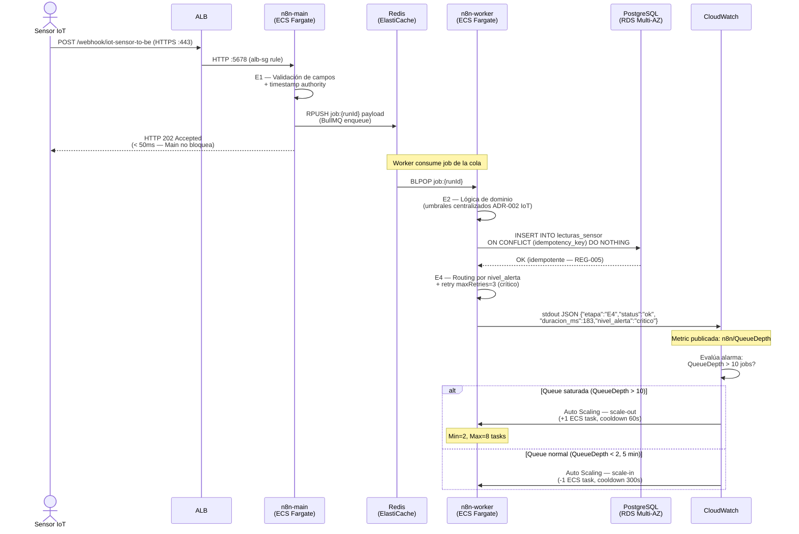

> 🌐 **Idioma / Language:** Español · [English](escalabilidad.en.md)

# Escalabilidad — n8n-microframework en AWS

**Versión:** 1.0
**Fecha:** 2026-05-18
**Fase:** 8 — Diseño de arquitectura AWS (OE4)
**Patrón central:** ECS Fargate + n8n Queue Mode (BullMQ sobre ElastiCache Redis)

---

## §1 Fundamento de escalabilidad: n8n Queue Mode

n8n tiene una limitación de diseño crítica para el escalado horizontal: en el modo
por defecto ("Main Mode"), un único proceso gestiona UI, webhooks Y ejecución de
workflows. Escalar este proceso requiere réplicas de estado compartido, lo que n8n
no soporta de forma nativa para la ejecución.

**Queue Mode** separa estas responsabilidades en dos tipos de proceso:

| Proceso | Rol | Escalado |
|---|---|---|
| **n8n-main** | UI · API REST · recepción de webhooks · encolado de jobs | Vertical planificado (1–2 instancias) |
| **n8n-workers** | Ejecución de workflows desde la cola Redis | Horizontal automático (2–8 instancias) |

La comunicación entre ambos usa **BullMQ** sobre Redis como cola de mensajes. Cada
webhook recibido por n8n-main genera un job en Redis; cualquier worker disponible
lo consume y ejecuta el workflow completo (E1 → E2 → E3 → E4).

### Diagrama 4 — Flujo de ejecución en Queue Mode (Sequence Diagram)

El diagrama muestra el flujo temporal completo desde la recepción del webhook IoT
hasta la persistencia en RDS y la publicación de métricas en CloudWatch, incluyendo
el trigger de auto-scaling cuando la queue excede el umbral.



*Figura 4. Flujo temporal: webhook → Queue Mode → Worker (E1-E4) → RDS → CloudWatch → Auto Scaling.*
*Renderizar en [mermaid.live](https://mermaid.live) o con `mmdc -i escalabilidad.md -o diag4-sequence.png -w 1600`.*

---

## §2 Auto-scaling de n8n-workers

### Política de escalado

El auto-scaling está orientado a la **profundidad de la cola Redis** (número de jobs
pendientes). Esta métrica es más representativa de la carga real que el CPU, ya que
n8n-workers puede tener CPU bajo mientras espera respuestas de APIs externas.

La profundidad de la cola se publica como **métrica custom** en CloudWatch desde
n8n-main cada 30 segundos:

```json
{
  "_aws": {
    "Timestamp": 1716042720000,
    "CloudWatchMetrics": [{
      "Namespace": "n8n/Queue",
      "Dimensions": [["QueueName"]],
      "Metrics": [{ "Name": "QueueDepth", "Unit": "Count" }]
    }]
  },
  "QueueName": "bull:n8n-jobs",
  "QueueDepth": 15
}
```

### Parámetros de la política

| Parámetro | Valor | Justificación |
|---|---|---|
| Mínimo de tareas | 2 | Alta disponibilidad — si un worker falla, queda 1 disponible |
| Máximo de tareas | 8 | Límite de conexiones RDS (8 workers × 25 conexiones = 200 = max_connections) |
| Umbral scale-out | QueueDepth > 10 jobs | Cada worker procesa ~5 jobs/min → 10 jobs = 1 min de backlog |
| Cooldown scale-out | 60 segundos | Tiempo mínimo entre expansiones sucesivas |
| Umbral scale-in | QueueDepth < 2 jobs durante 5 min | Evitar scale-in prematuro por variabilidad natural |
| Cooldown scale-in | 300 segundos | Conservador — reducir tareas tiene menor urgencia que aumentarlas |

### Configuración ECS Application Auto Scaling

```json
{
  "ServiceNamespace": "ecs",
  "ResourceId": "service/n8n-cluster/n8n-workers",
  "ScalableDimension": "ecs:service:DesiredCount",
  "MinCapacity": 2,
  "MaxCapacity": 8,
  "ScalingPolicies": [
    {
      "PolicyName": "workers-scale-out",
      "PolicyType": "StepScaling",
      "StepScalingPolicyConfiguration": {
        "AdjustmentType": "ChangeInCapacity",
        "StepAdjustments": [
          { "MetricIntervalLowerBound": 0, "MetricIntervalUpperBound": 20, "ScalingAdjustment": 1 },
          { "MetricIntervalLowerBound": 20, "ScalingAdjustment": 2 }
        ],
        "Cooldown": 60
      }
    },
    {
      "PolicyName": "workers-scale-in",
      "PolicyType": "StepScaling",
      "StepScalingPolicyConfiguration": {
        "AdjustmentType": "ChangeInCapacity",
        "StepAdjustments": [
          { "MetricIntervalUpperBound": 0, "ScalingAdjustment": -1 }
        ],
        "Cooldown": 300
      }
    }
  ]
}
```

---

## §3 Escalado de n8n-main (vertical planificado)

n8n-main no se escala horizontalmente porque:
1. n8n mantiene sesiones WebSocket con la UI — réplicas partirían las sesiones activas.
2. Los webhooks HTTPS son stateless, pero n8n-main usa estado en memoria para el
   tracking de ejecuciones en tiempo real.

**Estrategia:** escalado vertical planificado (cambio de Task Definition sin auto-scaling).

| Tier | CPU | RAM | Capacidad estimada |
|---|---|---|---|
| Dev | 0.5 vCPU | 1 GB | Hasta 5 workflows simultáneos |
| Staging | 1 vCPU | 2 GB | Hasta 20 workflows simultáneos |
| Producción | 2 vCPU | 4 GB | Hasta 50 webhooks/min concurrentes |

**Procedimiento de escalado vertical:**
1. Crear nueva revisión del Task Definition con mayor CPU/RAM.
2. Actualizar el servicio ECS: `aws ecs update-service --task-definition n8n-main:NUEVA`.
3. ECS ejecuta el Rolling Update automáticamente (sin downtime).

---

## §4 Escalado de RDS PostgreSQL

### Storage Auto-scaling

RDS tiene storage auto-scaling nativo que evita interrupciones por disco lleno:

```
storage_autoscaling_enabled = true
max_allocated_storage = 500  # GB máximo
```

El escalado de almacenamiento es automático e invisible para la aplicación.

### Réplicas de lectura (opcional, para análisis)

Las tablas `lecturas_sensor` e `interacciones_bot` pueden crecer significativamente en
Producción. Para análisis histórico sin impactar la BD principal:

```
Read Replica en us-east-1b (diferente AZ que primary)
  → Endpoint de solo lectura para dashboards y Log Insights SQL
  → n8n NO usa la réplica (siempre escribe/lee del primary para consistencia)
```

### Connection pooling — PgBouncer

Si el número de workers excede 8 (futura expansión), `max_connections=200` puede ser
insuficiente. La solución es añadir **PgBouncer** como proxy de conexiones:

```
n8n-workers (N×) → PgBouncer (ECS task) → RDS Primary
                   pool_mode = transaction
                   max_client_conn = 100
                   default_pool_size = 20
```

PgBouncer multiplexea conexiones: 100 workers pueden compartir 20 conexiones reales a RDS.

---

## §5 Escalado de ElastiCache Redis

### Configuración actual (single primary + 1 replica)

```
Tipo: cache.t3.small (1.37 GB RAM)
Modo: Cluster mode disabled (single shard)
Réplicas: 1 (read replica en AZ-b)
Capacidad BullMQ: ~100,000 jobs en memoria (estimado con payload de 10 KB por job)
```

### Cuándo escalar Redis

| Señal | Acción |
|---|---|
| `DatabaseMemoryUsagePercentage > 75%` | Escalar a `cache.t3.medium` (3.09 GB) |
| `EngineCPUUtilization > 90%` | Escalar a `cache.m5.large` (6.38 GB) |
| Necesidad de > 100K jobs concurrentes | Activar cluster mode (sharding) |

El escalado de ElastiCache requiere reemplazar el cluster (no hay escalado in-place
en cluster mode disabled). El proceso es:
1. Crear nuevo cluster con mayor capacidad.
2. Actualizar la variable `QUEUE_BULL_REDIS_HOST` en Secrets Manager.
2. Reiniciar tareas ECS (rolling restart).
3. BullMQ reconecta automáticamente.

---

## §6 Estrategia de despliegue — Zero Downtime

### Rolling Update (predeterminado)

ECS ejecuta Rolling Updates automáticamente cuando se actualiza el Task Definition.

```
Configuración del servicio:
  minimumHealthyPercent: 50   → tolera reemplazar mitad de las tareas en paralelo
  maximumPercent: 200         → puede correr el doble de tareas durante la transición

Ejemplo con 2 workers:
  Estado inicial:  [W1-v1] [W2-v1]
  Arranque nuevo:  [W1-v1] [W2-v1] [W1-v2] [W2-v2]  (max 200% = 4 tareas)
  Drain old:       [W1-v2] [W2-v2]
  Estado final:    [W1-v2] [W2-v2]
```

**Limitación de n8n:** Los workers en mitad de una ejecución de workflow cuando se detienen
pueden dejar jobs incompletos en Redis. BullMQ marca estos jobs como "stalled" y los
retoma el próximo worker disponible (mecanismo nativo de BullMQ).

### Blue/Green con CodeDeploy (recomendado para Producción)

Para despliegues de n8n-main (que tiene sesiones activas de UI):

```
1. Crear nuevo Target Group "green" con n8n-main:NUEVA versión
2. ALB cambia el 10% del tráfico a "green" (canary)
3. CloudWatch valida métricas durante 5 minutos
4. Si OK: ALB migra 100% a "green" → terminar "blue"
5. Si alarma: rollback automático a "blue"
```

---

## §7 Mapeo de REGs del micro-framework al diseño de escalabilidad

Cada patrón de resiliencia implementado en los flujos n8n to-be tiene su equivalente
en la capa de infraestructura AWS:

| REG | Descripción | Implementación local (Docker) | Implementación AWS |
|---|---|---|---|
| **REG-003** | Error workflow obligatorio | `Error Workflow` configurado en n8n | CloudWatch Alarm activa SNS si error workflow se dispara > 10×/5min |
| **REG-004** | Retry con backoff exponencial | `maxRetries=3` en nodos HTTP (n8n) | ALB health checks con backoff; BullMQ retry automático de jobs stalled |
| **REG-005** | Idempotencia — ON CONFLICT | `ON CONFLICT (idempotency_key) DO NOTHING` en PostgreSQL | RDS Multi-AZ preserva el esquema de idempotencia; failover < 60s no pierde commits |
| **REG-006** | Logs estructurados JSON | stdout en Docker → efímero | CloudWatch Logs persiste logs indefinidamente (resuelve R-GLOBAL-01) |

---

## §8 Limitaciones conocidas del escalado de n8n en AWS

| Limitación | Descripción | Mitigación |
|---|---|---|
| `N8N_ENCRYPTION_KEY` compartida | Todos los contenedores deben usar la misma clave o no pueden descifrar credenciales | Compartida via Secrets Manager — actualizar requiere reiniciar TODOS los contenedores simultáneamente |
| `WEBHOOK_URL` fija | Debe apuntar al DNS del ALB o dominio fijo; no puede variar por instancia | Usar dominio Route 53 fijo apuntando al ALB (no usar IP directa) |
| Sesiones WebSocket UI | La UI de n8n usa WebSockets; un ALB con múltiples instancias de n8n-main requiere sticky sessions | Activar sticky sessions en ALB con duración de 1 hora |
| Estado en memoria | n8n-main mantiene estado de ejecuciones activas en memoria | En fallo de n8n-main, BullMQ retoma jobs desde Redis; estado UI se pierde (sin impacto en datos) |

---

## Referencias

- `arquitectura-aws.md` — ECS Task Definitions, ALB (§4); ElastiCache Redis (§5)
- `observabilidad-aws.md` — CloudWatch Metrics/Alarms, métricas custom n8n/Queue (§5)
- `seguridad-iam.md` — IAM roles para escalado (§2); Secrets Manager para QUEUE vars (§3)
- `microframework/adr/ADR-MF-006-n8n-queue-mode.md` — Decisión formal de Queue Mode
- `docs/atam/registro-riesgos-tradeoffs.md` — R-GLOBAL-01, TP-IOT-01
