> 🌐 **Language / Idioma:** English · [Español](estimacion-costos.md)

# Cost Estimation — n8n-microframework on AWS

**Version:** 1.0
**Date:** 2026-05-18
**Reference region:** us-east-1 (N. Virginia)
**Pricing period:** Q2 2026 (estimates — verify with the AWS Pricing Calculator)

---

## §1 General assumptions

| Assumption | Value |
|---|---|
| Region | us-east-1 (us-east-1a, us-east-1b) |
| Billing mode | On-Demand (no upfront commitments) |
| Hours per month | 730 h/month |
| Network traffic | Estimated minimum (< 100 GB/month between services) |
| Inter-AZ data transfer | Included in the estimate — $0.01/GB |
| AWS Support | Basic (free) — not included in the estimate |
| n8n license | n8n Community Edition (open source, free) |
| ECS Fargate pricing | vCPU: $0.04048/h · RAM GB: $0.004445/h |
| RDS PostgreSQL pricing | db.t3.small Single-AZ: ~$0.034/h · Multi-AZ: ~$0.068/h |
| ElastiCache pricing | cache.t3.small: ~$0.034/h |
| ALB pricing | $0.008/h + $0.008/LCU-h (estimated 1 LCU) |
| NAT Gateway pricing | $0.045/h + $0.045/GB |

---

## §2 Breakdown by component and tier

### Dev Tier — Individual development environment

Characteristics: no high availability, minimal redundancy, partial use (8h/day).
Goal: validate the micro-framework locally with no significant cost.

| Component | Configuration | Estimated cost/month |
|---|---|---|
| ECS Fargate — n8n-main | 0.5 vCPU · 1 GB · 8h/day · 22 days | ~$6 |
| ECS Fargate — workers (1×) | 0.5 vCPU · 1 GB · 8h/day · 22 days | ~$6 |
| ECS Fargate — mock-bot + mock-iot | 0.25 vCPU · 0.5 GB each · 8h/day | ~$3 |
| RDS PostgreSQL | db.t3.micro · Single-AZ · 20 GB gp3 | ~$15 |
| ElastiCache Redis | Not included (use local Redis via Docker) | $0 |
| ALB | Not included (direct access to the ECS service) | $0 |
| S3 | < 1 GB · 1000 operations | ~$0.50 |
| Secrets Manager | 4 secrets · 1000 calls/month | ~$0.40 |
| CloudWatch Logs | < 5 GB ingested | ~$2.50 |
| NAT Gateway | Not included (use public endpoints) | $0 |
| **ESTIMATED TOTAL** | | **~$33/month** |

*Note: the Dev Tier can be reduced further by using local ECS with Localstack or
limiting RDS activity hours with the RDS Instance Scheduler.*

---

### Staging Tier — QA testing environment

Characteristics: 24/7 availability, no Multi-AZ, simulates production.
Goal: end-to-end integration testing and deployment validation.

| Component | Configuration | Estimated cost/month |
|---|---|---|
| ECS Fargate — n8n-main (1×) | 1 vCPU · 2 GB · 730h | ~$32 |
| ECS Fargate — workers (2×) | 1 vCPU · 2 GB each · 730h | ~$65 |
| ECS Fargate — mock-bot + mock-iot | 0.25 vCPU · 0.5 GB each · 730h | ~$11 |
| RDS PostgreSQL | db.t3.small · Single-AZ · 50 GB gp3 | ~$25 |
| ElastiCache Redis | cache.t3.micro · Single node | ~$17 |
| ALB | 1 ALB · 730h · estimated 0.5 LCU | ~$10 |
| S3 | < 5 GB · 10K operations | ~$1 |
| Secrets Manager | 4 secrets · 10K calls/month | ~$0.40 |
| CloudWatch Logs | < 20 GB ingested | ~$10 |
| NAT Gateway | 1 NAT GW · 730h · < 10 GB | ~$37 |
| **ESTIMATED TOTAL** | | **~$208/month** |

---

### Production Tier — Production environment with HA

Characteristics: Multi-AZ on RDS, 2 AZs on ECS, workers with auto-scaling 2–8, WAF.
Goal: support real adoption of the micro-framework in n8n.

| Component | Configuration | Estimated cost/month |
|---|---|---|
| ECS Fargate — n8n-main (2× AZs) | 1 vCPU · 2 GB each · 730h | ~$65 |
| ECS Fargate — workers (4× average) | 1 vCPU · 2 GB each · 730h | ~$130 |
| ECS Fargate — mock-bot + mock-iot | Lambda (prod) or 0.25 vCPU · 0.5 GB | ~$5–15 |
| RDS PostgreSQL | db.t3.small · **Multi-AZ** · 100 GB gp3 | ~$50 |
| ElastiCache Redis | cache.t3.small · 1 primary + 1 replica | ~$51 |
| ALB | 1 ALB · 730h · estimated 2 LCU | ~$23 |
| S3 | < 20 GB · 100K operations | ~$5 |
| Secrets Manager | 4 secrets · 100K calls/month | ~$0.50 |
| CloudWatch Logs + Metrics + Dashboard | 50 GB ingested · 10 alarms | ~$30 |
| NAT Gateway (2× AZs) | 2 NAT GW · 730h · < 50 GB | ~$87 |
| ACM | TLS certificate (free) | $0 |
| WAF | Web ACL + Managed Rules + traffic | ~$12 |
| **ESTIMATED TOTAL** | | **~$458/month** |

*Expected real range: $390–$600/month depending on traffic and the average number of active workers.*

---

## §3 Visual comparison by tier

### Diagram 7 — Estimated monthly costs by component and tier

```mermaid
xychart-beta
  title "Estimated monthly costs (USD) by component and tier"
  x-axis ["ECS Main", "ECS Workers", "ECS Mocks", "RDS PostgreSQL", "ElastiCache", "ALB", "NAT GW", "S3+CW+Other"]
  y-axis "USD/month" 0 --> 150
  bar [6, 6, 3, 15, 0, 0, 0, 3]
  bar [32, 65, 11, 25, 17, 10, 37, 11]
  bar [65, 130, 10, 50, 51, 23, 87, 42]
```



*Figure 7. Comparison of estimated monthly costs (USD) by component.*
*Bars left to right: Dev · Staging · Production.*
*Render at [mermaid.live](https://mermaid.live) or with `mmdc -i estimacion-costos.md -o diag7-costos.png -w 1400`.*

---

## §4 Consolidated summary

| Tier | Estimated cost/month | Estimated cost/year |
|---|:---:|:---:|
| **Dev** | ~$33 | ~$396 |
| **Staging** | ~$208 | ~$2,496 |
| **Production** | ~$458 | ~$5,496 |

*Note: all values are estimates in USD with On-Demand pricing for us-east-1.
Actual prices may vary. Using the AWS Pricing Calculator to validate against the
exact configuration before any deployment is recommended.*

---

## §5 Cost optimization strategies

### Optimization 1 — Fargate Spot for workers (savings: 60–70%)

The n8n-workers are ideal candidates for **Fargate Spot** because:
- BullMQ automatically resumes interrupted jobs.
- They have no local state — the job lives in Redis.
- Spot interruptions (Fargate Spot) come with a 2-minute notice.

```
Capacity Provider configuration:
  FARGATE_SPOT: weight=4, base=0
  FARGATE:      weight=1, base=2   ← Always keeps 2 On-Demand workers
```

**Estimated savings in Staging:** $65 × 70% = ~$45/month → $20/month on workers.
**Estimated savings in Production:** $130 × 70% = ~$91/month → $39/month on workers.

### Optimization 2 — Reserved Instances for RDS (savings: 30–40%)

RDS in Production is a constant workload — ideal for Reserved Instances (1 year):

```
RDS db.t3.small Multi-AZ On-Demand: ~$0.068/h = $50/month
RDS db.t3.small Multi-AZ Reserved 1yr All Upfront: ~$0.042/h = $31/month
Savings: ~$19/month = ~$228/year
```

### Optimization 3 — RDS instance scheduler in Dev/Staging (savings: 60%)

Turn off RDS outside business hours (20:00–08:00 and weekends):

```
Hours of use: 8h/day × 5 days = 40h/week vs 168h/week
Savings: 76% of RDS uptime → reduction from ~$15/month in Dev to ~$4/month
```

### Optimization 4 — Consolidate NAT Gateways (savings: $45/month in Production)

Production uses 2 NAT Gateways (one per AZ). If network fault tolerance allows it,
1 NAT Gateway in AZ-a can be used for both private zones:

```
Risk: if AZ-a has a network problem, containers in AZ-b lose internet access
(but not access to each other via internal VPC).
Savings: ~$33/month on NAT Gateway.
Recommendation: use 2 NAT GWs in Production (true HA); 1 NAT GW in Staging.
```

### Optimization 5 — S3 Intelligent Tiering

For n8n binary data with unpredictable access patterns:

```
Lifecycle Policy:
  0-30 days:    S3 Standard
  30-90 days:   S3 Standard-IA (40% cheaper)
  > 90 days:    S3 Glacier Instant Retrieval (68% cheaper than Standard)
```

---

## §6 Estimated savings with all optimizations (Production)

| Optimization | Estimated savings/month |
|---|---:|
| Fargate Spot for workers | ~$91 |
| Reserved Instances RDS (monthly prorated) | ~$19 |
| S3 Intelligent Tiering | ~$2 |
| **Total savings** | **~$112/month** |
| Unoptimized Production cost | ~$458/month |
| **Optimized Production cost** | **~$346/month** |

---

## §7 Comparison with alternatives

| Alternative | Estimated cost/month | Advantages | Disadvantages |
|---|:---:|---|---|
| **ECS Fargate (proposed design)** | ~$458 (Prod) | Serverless, no instance management, native auto-scaling | 30-40% more expensive than EC2 for constant load |
| EC2 (t3.medium × 2 for n8n) | ~$280 (Prod) | Cheaper for constant load | Instance management, patching, no native auto-scaling |
| EKS + Fargate | ~$600+ (Prod) | Full orchestration control | Excessive operational complexity for this case |
| n8n Cloud (SaaS) | ~$50–$300 (depending on plan) | No infrastructure management | No data control, no architectural customization |

*The choice of ECS Fargate (ADR-MF-005) prioritizes operational cost over
infrastructure cost — appropriate for an academic and research context.*

---

## References

- `arquitectura-aws.md` — Full configuration of each service (§4, §5)
- `microframework/adr/ADR-MF-005-ecs-fargate-vs-ec2.md` — Justification for Fargate
- `microframework/adr/ADR-MF-007-rds-multi-az.md` — Justification for Multi-AZ in Production
- AWS Pricing Calculator: https://calculator.aws/pricing/2/home
