# Estimación de Costos — n8n-microframework en AWS

**Versión:** 1.0
**Fecha:** 2026-05-18
**Fase:** 8 — Diseño de arquitectura AWS (OE4)
**Región de referencia:** us-east-1 (N. Virginia)
**Período de precios:** Q2 2026 (estimados — verificar en AWS Pricing Calculator)

---

## §1 Supuestos generales

| Supuesto | Valor |
|---|---|
| Región | us-east-1 (us-east-1a, us-east-1b) |
| Modo de facturación | On-Demand (sin compromisos previos) |
| Horas al mes | 730 h/mes |
| Tráfico de red | Estimado mínimo (< 100 GB/mes entre servicios) |
| Transferencia de datos inter-AZ | Incluida en estimación — $0.01/GB |
| Soporte AWS | Basic (gratuito) — no incluido en estimación |
| Licencia n8n | n8n Community Edition (código abierto, gratuita) |
| Precios ECS Fargate | vCPU: $0.04048/h · RAM GB: $0.004445/h |
| Precios RDS PostgreSQL | db.t3.small Single-AZ: ~$0.034/h · Multi-AZ: ~$0.068/h |
| Precios ElastiCache | cache.t3.small: ~$0.034/h |
| Precios ALB | $0.008/h + $0.008/LCU-h (estimado 1 LCU) |
| Precios NAT Gateway | $0.045/h + $0.045/GB |

---

## §2 Desglose por componente y tier

### Tier Dev — Entorno de desarrollo individual

Características: sin alta disponibilidad, mínima redundancia, uso parcial (8h/día).
Objetivo: validar el micro-framework localmente sin costo significativo.

| Componente | Configuración | Costo estimado/mes |
|---|---|---|
| ECS Fargate — n8n-main | 0.5 vCPU · 1 GB · 8h/día · 22 días | ~$6 |
| ECS Fargate — workers (1×) | 0.5 vCPU · 1 GB · 8h/día · 22 días | ~$6 |
| ECS Fargate — mock-bot + mock-iot | 0.25 vCPU · 0.5 GB c/u · 8h/día | ~$3 |
| RDS PostgreSQL | db.t3.micro · Single-AZ · 20 GB gp3 | ~$15 |
| ElastiCache Redis | No incluido (usar Redis local via Docker) | $0 |
| ALB | No incluido (acceso directo al servicio ECS) | $0 |
| S3 | < 1 GB · 1000 operaciones | ~$0.50 |
| Secrets Manager | 4 secretos · 1000 llamadas/mes | ~$0.40 |
| CloudWatch Logs | < 5 GB ingestados | ~$2.50 |
| NAT Gateway | No incluido (usar endpoints públicos) | $0 |
| **TOTAL ESTIMADO** | | **~$33/mes** |

*Nota: Tier Dev puede reducirse aún más usando ECS local con Localstack o limitando
el horario de actividad de RDS con RDS Instance Scheduler.*

---

### Tier Staging — Entorno de pruebas QA

Características: disponibilidad 24/7, sin Multi-AZ, simula producción.
Objetivo: pruebas de integración end-to-end y validación de despliegues.

| Componente | Configuración | Costo estimado/mes |
|---|---|---|
| ECS Fargate — n8n-main (1×) | 1 vCPU · 2 GB · 730h | ~$32 |
| ECS Fargate — workers (2×) | 1 vCPU · 2 GB c/u · 730h | ~$65 |
| ECS Fargate — mock-bot + mock-iot | 0.25 vCPU · 0.5 GB c/u · 730h | ~$11 |
| RDS PostgreSQL | db.t3.small · Single-AZ · 50 GB gp3 | ~$25 |
| ElastiCache Redis | cache.t3.micro · Single node | ~$17 |
| ALB | 1 ALB · 730h · estimado 0.5 LCU | ~$10 |
| S3 | < 5 GB · 10K operaciones | ~$1 |
| Secrets Manager | 4 secretos · 10K llamadas/mes | ~$0.40 |
| CloudWatch Logs | < 20 GB ingestados | ~$10 |
| NAT Gateway | 1 NAT GW · 730h · < 10 GB | ~$37 |
| **TOTAL ESTIMADO** | | **~$208/mes** |

---

### Tier Producción — Entorno productivo con HA

Características: Multi-AZ en RDS, 2 AZs en ECS, workers con auto-scaling 2–8, WAF.
Objetivo: soporte de adopción real del micro-framework en n8n.

| Componente | Configuración | Costo estimado/mes |
|---|---|---|
| ECS Fargate — n8n-main (2× AZs) | 1 vCPU · 2 GB c/u · 730h | ~$65 |
| ECS Fargate — workers (4× promedio) | 1 vCPU · 2 GB c/u · 730h | ~$130 |
| ECS Fargate — mock-bot + mock-iot | Lambda (prod) o 0.25 vCPU · 0.5 GB | ~$5–15 |
| RDS PostgreSQL | db.t3.small · **Multi-AZ** · 100 GB gp3 | ~$50 |
| ElastiCache Redis | cache.t3.small · 1 primary + 1 replica | ~$51 |
| ALB | 1 ALB · 730h · estimado 2 LCU | ~$23 |
| S3 | < 20 GB · 100K operaciones | ~$5 |
| Secrets Manager | 4 secretos · 100K llamadas/mes | ~$0.50 |
| CloudWatch Logs + Metrics + Dashboard | 50 GB ingestados · 10 alarmas | ~$30 |
| NAT Gateway (2× AZs) | 2 NAT GW · 730h · < 50 GB | ~$87 |
| ACM | Certificado TLS (gratuito) | $0 |
| WAF | Web ACL + Managed Rules + tráfico | ~$12 |
| **TOTAL ESTIMADO** | | **~$458/mes** |

*Rango real esperado: $390–$600/mes dependiendo del tráfico y el promedio de workers activos.*

---

## §3 Comparación visual por tier

### Diagrama 7 — Costos mensuales estimados por componente y tier

```mermaid
xychart-beta
  title "Estimación de costos mensuales (USD) por componente y tier"
  x-axis ["ECS Main", "ECS Workers", "ECS Mocks", "RDS PostgreSQL", "ElastiCache", "ALB", "NAT GW", "S3+CW+Otros"]
  y-axis "USD/mes" 0 --> 150
  bar [6, 6, 3, 15, 0, 0, 0, 3]
  bar [32, 65, 11, 25, 17, 10, 37, 11]
  bar [65, 130, 10, 50, 51, 23, 87, 42]
```



*Figura 7. Comparación de costos mensuales estimados (USD) por componente.*
*Barras izquierda → derecha: Dev · Staging · Producción.*
*Renderizar en [mermaid.live](https://mermaid.live) o con `mmdc -i estimacion-costos.md -o diag7-costos.png -w 1400`.*

---

## §4 Resumen consolidado

| Tier | Costo estimado/mes | Costo estimado/año |
|---|:---:|:---:|
| **Dev** | ~$33 | ~$396 |
| **Staging** | ~$208 | ~$2,496 |
| **Producción** | ~$458 | ~$5,496 |

*Nota: Todos los valores son estimaciones en USD con precios On-Demand de us-east-1.
Los precios reales pueden variar. Se recomienda usar AWS Pricing Calculator para
validar con la configuración exacta antes de cualquier despliegue.*

---

## §5 Estrategias de optimización de costos

### Optimización 1 — Fargate Spot para workers (ahorro: 60–70%)

Los n8n-workers son candidatos ideales para **Fargate Spot** porque:
- BullMQ retoma automáticamente jobs interrumpidos.
- No tienen estado local — el job vive en Redis.
- Las interrupciones de Spot (Fargate Spot) tienen aviso de 2 minutos.

```
Configuración de Capacity Provider:
  FARGATE_SPOT: weight=4, base=0
  FARGATE:      weight=1, base=2   ← Mantiene 2 workers On-Demand siempre
```

**Ahorro estimado en Staging:** $65 × 70% = ~$45/mes → $20/mes en workers.
**Ahorro estimado en Producción:** $130 × 70% = ~$91/mes → $39/mes en workers.

### Optimización 2 — Reserved Instances para RDS (ahorro: 30–40%)

RDS en Producción es carga constante — ideal para Reserved Instances (1 año):

```
RDS db.t3.small Multi-AZ On-Demand: ~$0.068/h = $50/mes
RDS db.t3.small Multi-AZ Reserved 1yr All Upfront: ~$0.042/h = $31/mes
Ahorro: ~$19/mes = ~$228/año
```

### Optimización 3 — RDS instance scheduler en Dev/Staging (ahorro: 60%)

Apagar RDS fuera del horario laboral (20:00–08:00 y fines de semana):

```
Horas de uso: 8h/día × 5 días = 40h/semana vs 168h/semana
Ahorro: 76% del tiempo de RDS → reducción de ~$15/mes en Dev a ~$4/mes
```

### Optimización 4 — Consolidar NAT Gateways (ahorro: $45/mes en Producción)

En Producción se usan 2 NAT Gateways (uno por AZ). Si la tolerancia a fallos de red
lo permite, se puede usar 1 NAT Gateway en AZ-a para ambas zonas privadas:

```
Riesgo: si AZ-a tiene un problema de red, los contenedores en AZ-b pierden acceso
a internet (pero no entre sí vía VPC interno).
Ahorro: ~$33/mes en NAT Gateway.
Recomendación: usar 2 NAT GW en Producción (HA real); 1 NAT GW en Staging.
```

### Optimización 5 — S3 Intelligent Tiering

Para datos binarios de n8n con patrones de acceso impredecibles:

```
Lifecycle Policy:
  0-30 días:    S3 Standard
  30-90 días:   S3 Standard-IA (40% más barato)
  > 90 días:    S3 Glacier Instant Retrieval (68% más barato que Standard)
```

---

## §6 Estimación de ahorro con todas las optimizaciones (Producción)

| Optimización | Ahorro estimado/mes |
|---|---:|
| Fargate Spot para workers | ~$91 |
| Reserved Instances RDS (prorrateo mensual) | ~$19 |
| S3 Intelligent Tiering | ~$2 |
| **Total ahorro** | **~$112/mes** |
| Costo Producción sin optimizar | ~$458/mes |
| **Costo Producción optimizado** | **~$346/mes** |

---

## §7 Comparación con alternativas

| Alternativa | Costo estimado/mes | Ventajas | Desventajas |
|---|:---:|---|---|
| **ECS Fargate (diseño propuesto)** | ~$458 (Prod) | Serverless, sin gestión de instancias, auto-scaling nativo | 30-40% más caro que EC2 para carga constante |
| EC2 (t3.medium × 2 para n8n) | ~$280 (Prod) | Más barato para carga constante | Gestión de instancias, patching, sin auto-scaling nativo |
| EKS + Fargate | ~$600+ (Prod) | Control total de orquestación | Complejidad operacional excesiva para este caso |
| n8n Cloud (SaaS) | ~$50–$300 (según plan) | Sin gestión de infra | Sin control de datos, sin personalización arquitectónica |

*La elección de ECS Fargate (ADR-MF-005) prioriza el costo operacional sobre el costo
de infraestructura — adecuado para un contexto académico y de investigación.*

---

## Referencias

- `arquitectura-aws.md` — Configuración completa de cada servicio (§4, §5)
- `microframework/adr/ADR-MF-005-ecs-fargate-vs-ec2.md` — Justificación de Fargate
- `microframework/adr/ADR-MF-007-rds-multi-az.md` — Justificación Multi-AZ en Producción
- AWS Pricing Calculator: https://calculator.aws/pricing/2/home
