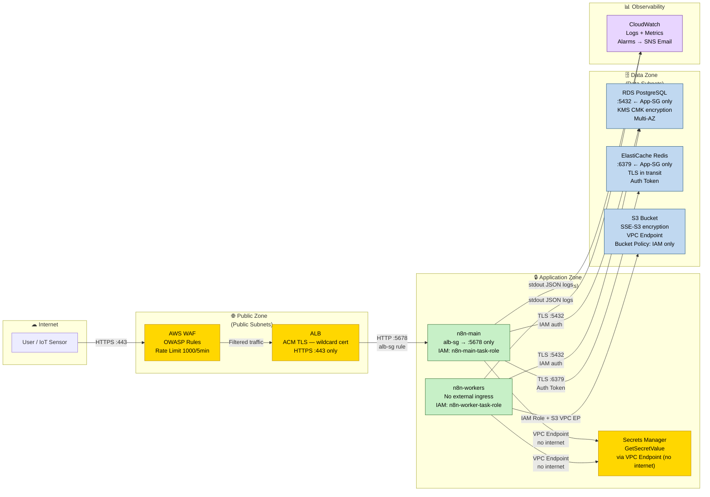
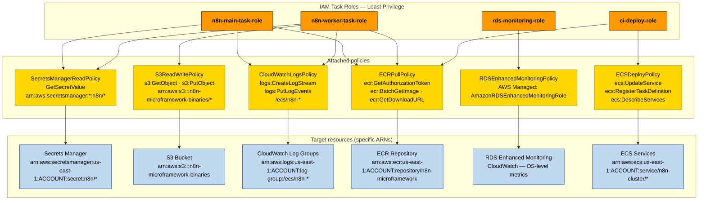

> 🌐 **Language / Idioma:** English · [Español](seguridad-iam.md)

# Security and IAM — n8n-microframework on AWS

**Version:** 1.0
**Date:** 2026-05-18
**Phase:** 8 — AWS architecture design (SO4)
**ATAM risk resolution:** R-BOT-01 (token rotation), SP-IOT-01 (error handler channel)

---

## §1 Executive security summary

The security model follows the **defense in depth** principle: multiple layers of controls that reinforce each other. No component has unrestricted access to another; each service operates with the minimum privilege necessary for its function.

### Diagram 5 — Trust zones and security controls

The diagram shows the architecture's three trust zones and the controls protecting each boundary. Colors distinguish the control type:
- **Yellow**: perimeter security controls (WAF, TLS, ACM)
- **Green**: application services (n8n-main, n8n-workers)
- **Blue**: data zone (RDS, Redis, S3, Secrets Manager)
- **Purple**: observability (CloudWatch)



*Figure 5. Trust zones and security controls — n8n-microframework on AWS.*
*Render at [mermaid.live](https://mermaid.live) or with `mmdc -i seguridad-iam.md -o diag5-zonas.png -w 1600`.*

---

## §2 IAM design — Least Privilege per service

### Principles applied

1. **Role separation per service**: each ECS Task Definition has its own IAM Task Role.
2. **Resource-specific ARNs**: no policy uses `Resource: "*"` — each action references the exact ARN of the target resource.
3. **No credentials in code**: environment variables are injected from Secrets Manager at container startup (ECS Secrets integration). Resolves the micro-framework's **REG-001**.
4. **Automatic rotation**: short-lived credentials (RDS password, Redis auth token) rotate automatically via a Secrets Manager rotation Lambda.
5. **Separate ci-deploy-role**: the CI/CD deployment role has ECS update permissions but no access to data (RDS, S3, production Secrets Manager).

### Diagram 6 — IAM hierarchy: roles → policies → resources



*Figure 6. IAM hierarchy: roles, attached policies, and target resources with specific ARNs.*
*Render at [mermaid.live](https://mermaid.live) or with `mmdc -i seguridad-iam.md -o diag6-iam.png -w 1600`.*

---

### Detailed definition of IAM Task Roles

#### `n8n-main-task-role`

Role assigned to the n8n-main Task Definition (UI, webhooks, REST API, enqueuing).

```json
{
  "RoleName": "n8n-main-task-role",
  "AssumeRolePolicyDocument": {
    "Statement": [{
      "Effect": "Allow",
      "Principal": { "Service": "ecs-tasks.amazonaws.com" },
      "Action": "sts:AssumeRole"
    }]
  },
  "InlinePolicies": {
    "SecretsManagerReadPolicy": {
      "Statement": [{
        "Effect": "Allow",
        "Action": ["secretsmanager:GetSecretValue"],
        "Resource": [
          "arn:aws:secretsmanager:us-east-1:ACCOUNT_ID:secret:n8n/db-password-*",
          "arn:aws:secretsmanager:us-east-1:ACCOUNT_ID:secret:n8n/encryption-key-*",
          "arn:aws:secretsmanager:us-east-1:ACCOUNT_ID:secret:n8n/redis-auth-token-*",
          "arn:aws:secretsmanager:us-east-1:ACCOUNT_ID:secret:n8n/api-tokens-*"
        ]
      }]
    },
    "CloudWatchLogsPolicy": {
      "Statement": [{
        "Effect": "Allow",
        "Action": [
          "logs:CreateLogGroup",
          "logs:CreateLogStream",
          "logs:PutLogEvents"
        ],
        "Resource": "arn:aws:logs:us-east-1:ACCOUNT_ID:log-group:/ecs/n8n-main:*"
      }]
    },
    "ECRPullPolicy": {
      "Statement": [{
        "Effect": "Allow",
        "Action": [
          "ecr:GetAuthorizationToken",
          "ecr:BatchCheckLayerAvailability",
          "ecr:GetDownloadUrlForLayer",
          "ecr:BatchGetImage"
        ],
        "Resource": "*"
      }]
    }
  }
}
```

**Note:** `n8n-main` has no access to S3 because binary data operations are executed by the workers. `ecr:GetAuthorizationToken` requires `Resource: "*"` by design of the ECR API.

---

#### `n8n-worker-task-role`

Role assigned to the n8n-workers Task Definition (workflow execution).

```json
{
  "RoleName": "n8n-worker-task-role",
  "InlinePolicies": {
    "SecretsManagerReadPolicy": {
      "Statement": [{
        "Effect": "Allow",
        "Action": ["secretsmanager:GetSecretValue"],
        "Resource": [
          "arn:aws:secretsmanager:us-east-1:ACCOUNT_ID:secret:n8n/db-password-*",
          "arn:aws:secretsmanager:us-east-1:ACCOUNT_ID:secret:n8n/encryption-key-*",
          "arn:aws:secretsmanager:us-east-1:ACCOUNT_ID:secret:n8n/redis-auth-token-*",
          "arn:aws:secretsmanager:us-east-1:ACCOUNT_ID:secret:n8n/api-tokens-*"
        ]
      }]
    },
    "S3ReadWritePolicy": {
      "Statement": [{
        "Effect": "Allow",
        "Action": ["s3:GetObject", "s3:PutObject", "s3:DeleteObject"],
        "Resource": "arn:aws:s3:::n8n-microframework-binaries/*"
      }, {
        "Effect": "Allow",
        "Action": ["s3:ListBucket"],
        "Resource": "arn:aws:s3:::n8n-microframework-binaries"
      }]
    },
    "CloudWatchLogsPolicy": {
      "Statement": [{
        "Effect": "Allow",
        "Action": [
          "logs:CreateLogGroup",
          "logs:CreateLogStream",
          "logs:PutLogEvents"
        ],
        "Resource": "arn:aws:logs:us-east-1:ACCOUNT_ID:log-group:/ecs/n8n-workers:*"
      }]
    },
    "ECRPullPolicy": {
      "Statement": [{
        "Effect": "Allow",
        "Action": [
          "ecr:GetAuthorizationToken",
          "ecr:BatchCheckLayerAvailability",
          "ecr:GetDownloadUrlForLayer",
          "ecr:BatchGetImage"
        ],
        "Resource": "*"
      }]
    }
  }
}
```

---

#### `rds-enhanced-monitoring-role`

Role managed by AWS for RDS Enhanced Monitoring. Allows RDS to publish operating-system metrics to CloudWatch.

```json
{
  "RoleName": "rds-enhanced-monitoring-role",
  "AssumeRolePolicyDocument": {
    "Statement": [{
      "Effect": "Allow",
      "Principal": { "Service": "monitoring.rds.amazonaws.com" },
      "Action": "sts:AssumeRole"
    }]
  },
  "ManagedPolicies": [
    "arn:aws:iam::aws:policy/service-role/AmazonRDSEnhancedMonitoringRole"
  ]
}
```

---

#### `ci-deploy-role`

Role assumed by the CI/CD pipeline (GitHub Actions) to deploy new versions.
Has minimal access to update ECS services with no access to production data.

```json
{
  "RoleName": "ci-deploy-role",
  "AssumeRolePolicyDocument": {
    "Statement": [{
      "Effect": "Allow",
      "Principal": {
        "Federated": "arn:aws:iam::ACCOUNT_ID:oidc-provider/token.actions.githubusercontent.com"
      },
      "Action": "sts:AssumeRoleWithWebIdentity",
      "Condition": {
        "StringLike": {
          "token.actions.githubusercontent.com:sub":
            "repo:GITHUB_ORG/n8n-microframework:ref:refs/heads/main"
        }
      }
    }]
  },
  "InlinePolicies": {
    "ECSDeployPolicy": {
      "Statement": [{
        "Effect": "Allow",
        "Action": [
          "ecs:UpdateService",
          "ecs:RegisterTaskDefinition",
          "ecs:DescribeServices",
          "ecs:DescribeTaskDefinition"
        ],
        "Resource": [
          "arn:aws:ecs:us-east-1:ACCOUNT_ID:cluster/n8n-cluster",
          "arn:aws:ecs:us-east-1:ACCOUNT_ID:service/n8n-cluster/*",
          "arn:aws:ecs:us-east-1:ACCOUNT_ID:task-definition/n8n-*"
        ]
      }, {
        "Effect": "Allow",
        "Action": [
          "ecr:GetAuthorizationToken",
          "ecr:BatchCheckLayerAvailability",
          "ecr:GetDownloadUrlForLayer",
          "ecr:BatchGetImage",
          "ecr:InitiateLayerUpload",
          "ecr:UploadLayerPart",
          "ecr:CompleteLayerUpload",
          "ecr:PutImage"
        ],
        "Resource": "*"
      }]
    }
  }
}
```

**Security note:** The CI/CD role uses GitHub Actions OIDC (OpenID Connect), removing the need to store permanent AWS credentials in GitHub secrets. The `sub` condition restricts access to pushes on the `main` branch only.

---

## §3 AWS Secrets Manager — Credential management

### R-BOT-01 resolution

The **R-BOT-01** architectural risk identified in ATAM describes the absence of automatic API token rotation in the local micro-framework. In AWS, this risk is structurally resolved through Secrets Manager + automatic Lambda rotation.

### Defined secrets

| Secret name | Type | Rotation | Notes |
|---|---|---|---|
| `n8n/db-password` | RDS password | ✅ Automatic — 30 days | Native RDS rotation Lambda |
| `n8n/encryption-key` | N8N_ENCRYPTION_KEY | ❌ No rotation | Change = unrecoverable n8n credentials |
| `n8n/redis-auth-token` | ElastiCache auth token | ✅ Automatic — 90 days | Custom Lambda (ElastiCache has no native rotation) |
| `n8n/api-tokens` | JSON with external tokens | ✅ Manual — per provider | mock-bot and mock-iot tokens; in prod, replace with the provider's own rotation |

### Secret structure (JSON format)

```json
// n8n/db-password
{
  "username": "n8n",
  "password": "<AUTOMATICALLY_GENERATED>",
  "engine": "postgres",
  "host": "<RDS_ENDPOINT>",
  "port": 5432,
  "dbname": "n8n_db"
}

// n8n/encryption-key
{
  "N8N_ENCRYPTION_KEY": "<32_RANDOM_BASE64_BYTES>"
}

// n8n/redis-auth-token
{
  "auth-token": "<64_CHAR_REDIS_TOKEN>"
}

// n8n/api-tokens
{
  "BOT_API_TOKEN": "<MOCK_BOT_TOKEN>",
  "IOT_NOTIFY_TOKEN": "<MOCK_IOT_TOKEN>",
  "IOT_WEBHOOK_SECRET": "<HMAC_SECRET>"
}
```

### Automatic rotation of `n8n/db-password`

AWS Secrets Manager and RDS have native integration for password rotation:

1. Secrets Manager calls the rotation Lambda every 30 days.
2. The Lambda generates a new password, updates it in RDS (via `ALTER USER`), and updates the secret.
3. n8n-main and n8n-workers read the new password on the container's next restart.

**Recommended configuration:**
- Rotation enabled: `RotationRules.AutomaticallyAfterDays = 30`
- `RotationLambdaARN`: ARN of the `SecretsManagerRDSPostgreSQLRotationSingleUser` Lambda (managed by AWS)
- No forced container restart is required if n8n reconnects correctly on auth errors.

---

## §4 Encryption in transit and at rest

### In transit

| Connection | Protocol | Certificate |
|---|---|---|
| Client → ALB | HTTPS (TLS 1.2+) | ACM — wildcard `*.dominio.com` |
| ALB → n8n-main | Internal HTTP (private VPC) | Not required — internal traffic |
| n8n → RDS | TLS (enforced via `sslmode=require`) | RDS CA certificate (AWS) |
| n8n → Redis | TLS (enforced via ElastiCache `in-transit encryption`) | ElastiCache certificate (AWS) |
| n8n → S3 | HTTPS (AWS SDK) | ACM/AWS |
| n8n → Secrets Manager | HTTPS (VPC Endpoint) | ACM/AWS |

### At rest

| Service | Encryption | Key |
|---|---|---|
| RDS PostgreSQL | AES-256 via KMS | KMS CMK (Customer Managed Key) — annual rotation |
| ElastiCache Redis | AES-256 via ElastiCache encryption | KMS CMK shared with RDS |
| S3 | SSE-S3 (AES-256) | AWS-managed key (no additional cost) |
| CloudWatch Logs | AES-256 via KMS (optional) | If enabled, use the same CMK as RDS |
| Secrets Manager | AES-256 via KMS | KMS CMK with a policy allowing only n8n roles |

### KMS CMK — key policy

```json
{
  "Statement": [
    {
      "Sid": "AllowRootAccount",
      "Effect": "Allow",
      "Principal": { "AWS": "arn:aws:iam::ACCOUNT_ID:root" },
      "Action": "kms:*",
      "Resource": "*"
    },
    {
      "Sid": "AllowN8NServices",
      "Effect": "Allow",
      "Principal": {
        "AWS": [
          "arn:aws:iam::ACCOUNT_ID:role/n8n-main-task-role",
          "arn:aws:iam::ACCOUNT_ID:role/n8n-worker-task-role"
        ]
      },
      "Action": [
        "kms:Decrypt",
        "kms:GenerateDataKey"
      ],
      "Resource": "*"
    },
    {
      "Sid": "AllowRDSService",
      "Effect": "Allow",
      "Principal": { "Service": "rds.amazonaws.com" },
      "Action": [
        "kms:Decrypt",
        "kms:GenerateDataKey",
        "kms:CreateGrant"
      ],
      "Resource": "*"
    }
  ]
}
```

---

## §5 ACM — SSL/TLS certificates

### ALB certificate

AWS Certificate Manager (ACM) is used with DNS validation via Route 53. ACM automatically renews the certificate before it expires (typically 30 days ahead).

**Configuration:**
- **Type:** Public ACM certificate (free)
- **Domain:** `n8n.dominio.com` (or wildcard `*.dominio.com`)
- **Validation:** DNS — CNAME record in Route 53 (automatic if Route 53 manages the domain)
- **Algorithm:** RSA 2048 bits (or ECDSA P-256 for better performance)
- **ALB Listener:** Port 443, HTTPS protocol, security policy `ELBSecurityPolicy-TLS13-1-2-2021-06`

**HTTP → HTTPS redirect:**
```
ALB Listener 80 → Rule: Redirect to HTTPS 443 (301 Permanent)
```

---

## §6 AWS WAF — Web application protection (optional for production)

WAF is optional in research environments (Dev/Staging), but recommended in Production when the n8n instance is exposed to real traffic.

### Configured Web ACL

| Rule | Type | Action | Purpose |
|---|---|---|---|
| `AWSManagedRulesCommonRuleSet` | Managed | Block | OWASP Top 10 protection (SQLi, XSS, etc.) |
| `AWSManagedRulesKnownBadInputsRuleSet` | Managed | Block | Known malicious inputs |
| `RateLimitRule` | Custom Rate-based | Block | Max. 1000 requests/5min per IP |
| `WebhookRateLimitRule` | Custom Rate-based | Count | Max. 100 req/min on `/webhook/*` (monitoring) |

### Association

```
WAF Web ACL → ALB ARN → applies to all ALB listeners
```

**WAF cost (reference):** ~$5/mo (Web ACL) + ~$1/mo (per 1M requests) + ~$1/mo (per managed rule). Estimated total: ~$7–12/mo additional in Production.

---

## §7 Security Groups — Explicit network rules

Complementing what is defined in `arquitectura-aws.md §3`, the full rules are detailed here from a security perspective (implicit deny for anything not allowed).

### Allowed traffic flow

```
Internet → WAF → ALB (alb-sg) → n8n-main (n8n-main-sg) → RDS (rds-sg)
                                                          → Redis (redis-sg)
                                → n8n-workers (n8n-worker-sg) → RDS (rds-sg)
                                                               → Redis (redis-sg)
                                                               → S3 (VPC Endpoint)
```

### `alb-sg` (Application Load Balancer)

| Direction | Port | Source/Destination | Purpose |
|---|---|---|---|
| Ingress | 443 (HTTPS) | 0.0.0.0/0 | Public HTTPS traffic |
| Ingress | 80 (HTTP) | 0.0.0.0/0 | Redirect to HTTPS (301) |
| Egress | 5678 | n8n-main-sg | Forwarding to n8n-main |

### `n8n-main-sg` (n8n Main Process)

| Direction | Port | Source/Destination | Purpose |
|---|---|---|---|
| Ingress | 5678 | alb-sg | Only from ALB |
| Egress | 5432 | rds-sg | Connection to RDS |
| Egress | 6379 | redis-sg | Connection to Redis |
| Egress | 443 | 0.0.0.0/0 | Secrets Manager EP, ECR, external APIs |

### `n8n-worker-sg` (n8n Workers)

| Direction | Port | Source/Destination | Purpose |
|---|---|---|---|
| Ingress | — | — | No external ingress |
| Egress | 5432 | rds-sg | Connection to RDS |
| Egress | 6379 | redis-sg | Consuming jobs from Redis |
| Egress | 443 | 0.0.0.0/0 | S3 EP, Secrets Manager EP, external APIs |

### `rds-sg` (RDS PostgreSQL)

| Direction | Port | Source/Destination | Purpose |
|---|---|---|---|
| Ingress | 5432 | n8n-main-sg | Connections from n8n-main |
| Ingress | 5432 | n8n-worker-sg | Connections from workers |
| Egress | — | — | No egress (RDS does not initiate connections) |

### `redis-sg` (ElastiCache Redis)

| Direction | Port | Source/Destination | Purpose |
|---|---|---|---|
| Ingress | 6379 | n8n-main-sg | BullMQ enqueuing |
| Ingress | 6379 | n8n-worker-sg | BullMQ consumption |
| Egress | — | — | No egress |

### `mock-sg` (mock-bot and mock-iot — Dev/Staging only)

| Direction | Port | Source/Destination | Purpose |
|---|---|---|---|
| Ingress | 3001 | n8n-worker-sg | mock-bot API |
| Ingress | 3002 | n8n-worker-sg | mock-iot API |
| Egress | 443 | 0.0.0.0/0 | Not required — no external dependencies |

---

## §8 ATAM risk resolution through security controls

| ATAM risk | Original description | AWS mitigation | Mechanism |
|---|---|---|---|
| **R-BOT-01** | Absence of automatic API token rotation | ✅ **Resolved** | Secrets Manager automatic rotation (Lambda) every 30 days for `n8n/api-tokens` |
| **SP-IOT-01** | Error handler notification channel matches the E4 channel | ✅ **Mitigated** | CloudWatch Alarm independent of the E4 channel; SNS as an alternative alert channel |
| **R-GLOBAL-01** | Ephemeral logs (stdout is lost on container restart) | ✅ **Resolved** | CloudWatch Logs persists all E1-E4 JSON logs with configurable retention |
| **R-GLOBAL-02** | External contracts with no formal versioning | ⚠️ **Partial** | API Gateway + Lambda versioning for the mocks in Production; outside the scope of the reference design |

---

## §9 Security review checklist

Verification checklist before a Production environment deployment:

- [ ] All Task Roles have policies with specific ARNs (no `Resource: "*"` except for ECR auth)
- [ ] `N8N_ENCRYPTION_KEY` is in Secrets Manager and does NOT have rotation enabled
- [ ] `n8n/db-password` has automatic rotation enabled (30 days)
- [ ] ALB has an HTTP:80 listener that redirects to HTTPS:443
- [ ] ACM certificate is in `ISSUED` status with a validated domain
- [ ] Security Groups have no `0.0.0.0/0` ingress rule except alb-sg (ports 80/443)
- [ ] RDS has `StorageEncrypted: true` with a KMS CMK
- [ ] ElastiCache has `TransitEncryptionEnabled: true` and `AuthToken` configured
- [ ] S3 bucket has `BlockPublicAcls: true` and `BlockPublicPolicy: true`
- [ ] VPC Endpoints created for Secrets Manager, S3, and ECR (avoids internet traffic)
- [ ] WAF Web ACL associated with the ALB (optional Dev/Staging, recommended Prod)
- [ ] `ci-deploy-role` uses OIDC (no permanent credentials in GitHub Secrets)
- [ ] CloudTrail enabled on the account for AWS API call auditing

---

## References

- `arquitectura-aws.md` — VPC design, ECS Task Definitions, data (§3, §4, §5)
- `observabilidad-aws.md` — CloudWatch Logs, Alarms, SNS (SP-IOT-01 resolution)
- `microframework/reglas/reglas-obligatorias.md` — REG-001 (secrets), REG-006 (logs)
- `docs/atam/registro-riesgos-tradeoffs.md` — R-BOT-01, SP-IOT-01, R-GLOBAL-01, R-GLOBAL-02
- ADR-MF-005, ADR-MF-006, ADR-MF-007 — AWS architecture decisions
