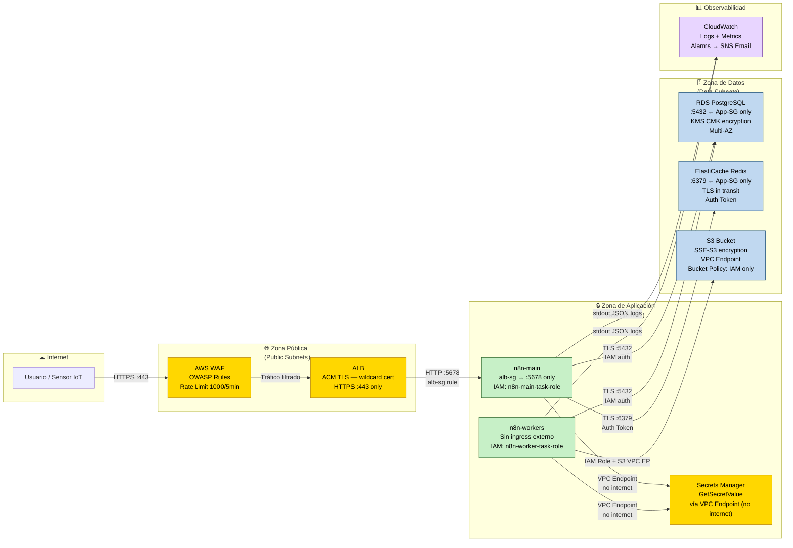
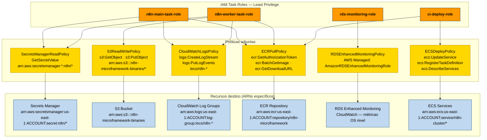

> 🌐 **Idioma / Language:** Español · [English](seguridad-iam.en.md)

# Seguridad e IAM — n8n-microframework en AWS

**Versión:** 1.0
**Fecha:** 2026-05-18
**Fase:** 8 — Diseño de arquitectura AWS (OE4)
**Resolución de riesgos ATAM:** R-BOT-01 (rotación de tokens), SP-IOT-01 (canal de error handler)

---

## §1 Resumen ejecutivo de seguridad

El modelo de seguridad sigue el principio de **defensa en profundidad**: múltiples capas
de control que se refuerzan mutuamente. Ningún componente tiene acceso irrestricto a
otro; cada servicio opera con el mínimo privilegio necesario para su función.

### Diagrama 5 — Zonas de confianza y controles de seguridad

El diagrama muestra las tres zonas de confianza de la arquitectura y los controles que
protegen cada frontera. Los colores distinguen el tipo de control:
- **Amarillo**: controles de seguridad perimetral (WAF, TLS, ACM)
- **Verde**: servicios de aplicación (n8n-main, n8n-workers)
- **Azul**: zona de datos (RDS, Redis, S3, Secrets Manager)
- **Violeta**: observabilidad (CloudWatch)



*Figura 5. Zonas de confianza y controles de seguridad — n8n-microframework en AWS.*
*Renderizar en [mermaid.live](https://mermaid.live) o con `mmdc -i seguridad-iam.md -o diag5-zonas.png -w 1600`.*

---

## §2 Diseño IAM — Least Privilege por servicio

### Principios aplicados

1. **Separación de roles por servicio**: cada Task Definition ECS tiene su propio IAM Task Role.
2. **Recursos específicos por ARN**: ninguna política usa `Resource: "*"` — cada acción
   referencia el ARN exacto del recurso destino.
3. **Sin credenciales en código**: las variables de entorno se inyectan desde Secrets Manager
   en el arranque del contenedor (ECS Secrets integration). Resuelve **REG-001** del micro-framework.
4. **Rotación automática**: las credenciales de corta vida (contraseña RDS, auth token Redis)
   rotan automáticamente vía Lambda de rotación de Secrets Manager.
5. **ci-deploy-role separado**: el rol de despliegue CI/CD tiene permisos de actualización
   ECS pero sin acceso a datos (RDS, S3, Secrets Manager producción).

### Diagrama 6 — Jerarquía IAM: roles → políticas → recursos



*Figura 6. Jerarquía IAM: roles, políticas adjuntas y recursos destino con ARNs específicos.*
*Renderizar en [mermaid.live](https://mermaid.live) o con `mmdc -i seguridad-iam.md -o diag6-iam.png -w 1600`.*

---

### Definición detallada de IAM Task Roles

#### `n8n-main-task-role`

Rol asignado al Task Definition de n8n-main (UI, webhooks, API REST, encolado).

```json
{
  "RoleName": "n8n-main-task-role",
  "AssumeRolePolicyDocument": {
    "Statement": [{
      "Effect": "Allow",
      "Principal": { "Service": "ecs-tasks.amazonaws.com" },
      "Action": "sts:AssumeRole"
    }]
  },
  "InlinePolicies": {
    "SecretsManagerReadPolicy": {
      "Statement": [{
        "Effect": "Allow",
        "Action": ["secretsmanager:GetSecretValue"],
        "Resource": [
          "arn:aws:secretsmanager:us-east-1:ACCOUNT_ID:secret:n8n/db-password-*",
          "arn:aws:secretsmanager:us-east-1:ACCOUNT_ID:secret:n8n/encryption-key-*",
          "arn:aws:secretsmanager:us-east-1:ACCOUNT_ID:secret:n8n/redis-auth-token-*",
          "arn:aws:secretsmanager:us-east-1:ACCOUNT_ID:secret:n8n/api-tokens-*"
        ]
      }]
    },
    "CloudWatchLogsPolicy": {
      "Statement": [{
        "Effect": "Allow",
        "Action": [
          "logs:CreateLogGroup",
          "logs:CreateLogStream",
          "logs:PutLogEvents"
        ],
        "Resource": "arn:aws:logs:us-east-1:ACCOUNT_ID:log-group:/ecs/n8n-main:*"
      }]
    },
    "ECRPullPolicy": {
      "Statement": [{
        "Effect": "Allow",
        "Action": [
          "ecr:GetAuthorizationToken",
          "ecr:BatchCheckLayerAvailability",
          "ecr:GetDownloadUrlForLayer",
          "ecr:BatchGetImage"
        ],
        "Resource": "*"
      }]
    }
  }
}
```

**Nota:** `n8n-main` no tiene acceso a S3 porque las operaciones de binary data las ejecutan
los workers. `ecr:GetAuthorizationToken` requiere `Resource: "*"` por diseño de la API de ECR.

---

#### `n8n-worker-task-role`

Rol asignado al Task Definition de n8n-workers (ejecución de workflows).

```json
{
  "RoleName": "n8n-worker-task-role",
  "InlinePolicies": {
    "SecretsManagerReadPolicy": {
      "Statement": [{
        "Effect": "Allow",
        "Action": ["secretsmanager:GetSecretValue"],
        "Resource": [
          "arn:aws:secretsmanager:us-east-1:ACCOUNT_ID:secret:n8n/db-password-*",
          "arn:aws:secretsmanager:us-east-1:ACCOUNT_ID:secret:n8n/encryption-key-*",
          "arn:aws:secretsmanager:us-east-1:ACCOUNT_ID:secret:n8n/redis-auth-token-*",
          "arn:aws:secretsmanager:us-east-1:ACCOUNT_ID:secret:n8n/api-tokens-*"
        ]
      }]
    },
    "S3ReadWritePolicy": {
      "Statement": [{
        "Effect": "Allow",
        "Action": ["s3:GetObject", "s3:PutObject", "s3:DeleteObject"],
        "Resource": "arn:aws:s3:::n8n-microframework-binaries/*"
      }, {
        "Effect": "Allow",
        "Action": ["s3:ListBucket"],
        "Resource": "arn:aws:s3:::n8n-microframework-binaries"
      }]
    },
    "CloudWatchLogsPolicy": {
      "Statement": [{
        "Effect": "Allow",
        "Action": [
          "logs:CreateLogGroup",
          "logs:CreateLogStream",
          "logs:PutLogEvents"
        ],
        "Resource": "arn:aws:logs:us-east-1:ACCOUNT_ID:log-group:/ecs/n8n-workers:*"
      }]
    },
    "ECRPullPolicy": {
      "Statement": [{
        "Effect": "Allow",
        "Action": [
          "ecr:GetAuthorizationToken",
          "ecr:BatchCheckLayerAvailability",
          "ecr:GetDownloadUrlForLayer",
          "ecr:BatchGetImage"
        ],
        "Resource": "*"
      }]
    }
  }
}
```

---

#### `rds-enhanced-monitoring-role`

Rol gestionado por AWS para Enhanced Monitoring de RDS. Permite a RDS publicar métricas
de sistema operativo en CloudWatch.

```json
{
  "RoleName": "rds-enhanced-monitoring-role",
  "AssumeRolePolicyDocument": {
    "Statement": [{
      "Effect": "Allow",
      "Principal": { "Service": "monitoring.rds.amazonaws.com" },
      "Action": "sts:AssumeRole"
    }]
  },
  "ManagedPolicies": [
    "arn:aws:iam::aws:policy/service-role/AmazonRDSEnhancedMonitoringRole"
  ]
}
```

---

#### `ci-deploy-role`

Rol asumido por el pipeline CI/CD (GitHub Actions) para desplegar nuevas versiones.
Tiene acceso mínimo para actualizar servicios ECS sin acceso a datos en producción.

```json
{
  "RoleName": "ci-deploy-role",
  "AssumeRolePolicyDocument": {
    "Statement": [{
      "Effect": "Allow",
      "Principal": {
        "Federated": "arn:aws:iam::ACCOUNT_ID:oidc-provider/token.actions.githubusercontent.com"
      },
      "Action": "sts:AssumeRoleWithWebIdentity",
      "Condition": {
        "StringLike": {
          "token.actions.githubusercontent.com:sub":
            "repo:GITHUB_ORG/n8n-microframework:ref:refs/heads/main"
        }
      }
    }]
  },
  "InlinePolicies": {
    "ECSDeployPolicy": {
      "Statement": [{
        "Effect": "Allow",
        "Action": [
          "ecs:UpdateService",
          "ecs:RegisterTaskDefinition",
          "ecs:DescribeServices",
          "ecs:DescribeTaskDefinition"
        ],
        "Resource": [
          "arn:aws:ecs:us-east-1:ACCOUNT_ID:cluster/n8n-cluster",
          "arn:aws:ecs:us-east-1:ACCOUNT_ID:service/n8n-cluster/*",
          "arn:aws:ecs:us-east-1:ACCOUNT_ID:task-definition/n8n-*"
        ]
      }, {
        "Effect": "Allow",
        "Action": [
          "ecr:GetAuthorizationToken",
          "ecr:BatchCheckLayerAvailability",
          "ecr:GetDownloadUrlForLayer",
          "ecr:BatchGetImage",
          "ecr:InitiateLayerUpload",
          "ecr:UploadLayerPart",
          "ecr:CompleteLayerUpload",
          "ecr:PutImage"
        ],
        "Resource": "*"
      }]
    }
  }
}
```

**Nota de seguridad:** El rol CI/CD usa OIDC (OpenID Connect) de GitHub Actions, eliminando
la necesidad de almacenar credenciales AWS permanentes en los secretos de GitHub. La condición
`sub` restringe el acceso solo a pushes al branch `main`.

---

## §3 AWS Secrets Manager — Gestión de credenciales

### Resolución de R-BOT-01

El riesgo arquitectónico **R-BOT-01** identificado en ATAM describe la ausencia de rotación
automática de tokens API en el micro-framework local. En AWS, este riesgo se resuelve
estructuralmente mediante Secrets Manager + rotación automática Lambda.

### Secrets definidos

| Nombre del secreto | Tipo | Rotación | Notas |
|---|---|---|---|
| `n8n/db-password` | RDS password | ✅ Automática — 30 días | Lambda de rotación RDS nativa |
| `n8n/encryption-key` | N8N_ENCRYPTION_KEY | ❌ No rotar | Cambio = credenciales n8n irrecuperables |
| `n8n/redis-auth-token` | ElastiCache auth token | ✅ Automática — 90 días | Lambda custom (ElastiCache no tiene rotación nativa) |
| `n8n/api-tokens` | JSON con tokens externos | ✅ Manual — según proveedor | mock-bot y mock-iot tokens; en prod reemplazar por rotación del proveedor |

### Estructura de secretos (formato JSON)

```json
// n8n/db-password
{
  "username": "n8n",
  "password": "<GENERADO_AUTOMATICAMENTE>",
  "engine": "postgres",
  "host": "<RDS_ENDPOINT>",
  "port": 5432,
  "dbname": "n8n_db"
}

// n8n/encryption-key
{
  "N8N_ENCRYPTION_KEY": "<32_BYTES_ALEATORIOS_BASE64>"
}

// n8n/redis-auth-token
{
  "auth-token": "<TOKEN_REDIS_64_CHARS>"
}

// n8n/api-tokens
{
  "BOT_API_TOKEN": "<TOKEN_MOCK_BOT>",
  "IOT_NOTIFY_TOKEN": "<TOKEN_MOCK_IOT>",
  "IOT_WEBHOOK_SECRET": "<HMAC_SECRET>"
}
```

### Rotación automática de `n8n/db-password`

AWS Secrets Manager + RDS tienen integración nativa para rotación de contraseñas:

1. Secrets Manager llama a la Lambda de rotación cada 30 días.
2. La Lambda genera una nueva contraseña, la actualiza en RDS (via `ALTER USER`), y actualiza el secret.
3. n8n-main y n8n-workers leen la contraseña nueva en el próximo restart del contenedor.

**Configuración recomendada:**
- Rotación activada: `RotationRules.AutomaticallyAfterDays = 30`
- `RotationLambdaARN`: ARN de la Lambda `SecretsManagerRDSPostgreSQLRotationSingleUser` (gestionada por AWS)
- No se requiere reinicio forzado de contenedores si n8n reconecta correctamente ante errores de auth.

---

## §4 Cifrado en tránsito y en reposo

### En tránsito (in-transit)

| Conexión | Protocolo | Certificado |
|---|---|---|
| Cliente → ALB | HTTPS (TLS 1.2+) | ACM — wildcard `*.dominio.com` |
| ALB → n8n-main | HTTP interno (VPC privada) | No requerido — tráfico interno |
| n8n → RDS | TLS (forzado via `sslmode=require`) | Certificado CA de RDS (AWS) |
| n8n → Redis | TLS (forzado via ElastiCache `in-transit encryption`) | Certificado de ElastiCache (AWS) |
| n8n → S3 | HTTPS (SDK AWS) | ACM/AWS |
| n8n → Secrets Manager | HTTPS (VPC Endpoint) | ACM/AWS |

### En reposo (at-rest)

| Servicio | Cifrado | Clave |
|---|---|---|
| RDS PostgreSQL | AES-256 via KMS | KMS CMK (Customer Managed Key) — rotación anual |
| ElastiCache Redis | AES-256 via ElastiCache encryption | KMS CMK compartida con RDS |
| S3 | SSE-S3 (AES-256) | Clave gestionada por AWS (sin costo adicional) |
| CloudWatch Logs | AES-256 via KMS (opcional) | Si se activa, usar misma CMK que RDS |
| Secrets Manager | AES-256 via KMS | KMS CMK con política que solo permite roles n8n |

### KMS CMK — política de clave

```json
{
  "Statement": [
    {
      "Sid": "AllowRootAccount",
      "Effect": "Allow",
      "Principal": { "AWS": "arn:aws:iam::ACCOUNT_ID:root" },
      "Action": "kms:*",
      "Resource": "*"
    },
    {
      "Sid": "AllowN8NServices",
      "Effect": "Allow",
      "Principal": {
        "AWS": [
          "arn:aws:iam::ACCOUNT_ID:role/n8n-main-task-role",
          "arn:aws:iam::ACCOUNT_ID:role/n8n-worker-task-role"
        ]
      },
      "Action": [
        "kms:Decrypt",
        "kms:GenerateDataKey"
      ],
      "Resource": "*"
    },
    {
      "Sid": "AllowRDSService",
      "Effect": "Allow",
      "Principal": { "Service": "rds.amazonaws.com" },
      "Action": [
        "kms:Decrypt",
        "kms:GenerateDataKey",
        "kms:CreateGrant"
      ],
      "Resource": "*"
    }
  ]
}
```

---

## §5 ACM — Certificados SSL/TLS

### Certificado del ALB

Se utiliza AWS Certificate Manager (ACM) con validación DNS via Route 53. ACM renueva
el certificado automáticamente antes de su expiración (generalmente 30 días antes).

**Configuración:**
- **Tipo:** Certificado público ACM (gratuito)
- **Dominio:** `n8n.dominio.com` (o wildcard `*.dominio.com`)
- **Validación:** DNS — CNAME record en Route 53 (automático si Route 53 gestiona el dominio)
- **Algoritmo:** RSA 2048 bits (o ECDSA P-256 para mejor performance)
- **ALB Listener:** Puerto 443, protocolo HTTPS, política de seguridad `ELBSecurityPolicy-TLS13-1-2-2021-06`

**Redirect HTTP → HTTPS:**
```
ALB Listener 80 → Rule: Redirect to HTTPS 443 (301 Permanent)
```

---

## §6 AWS WAF — Protección de aplicación web (opcional para producción)

El WAF es opcional en entornos de investigación (Dev/Staging), pero recomendado en Producción
cuando la instancia de n8n está expuesta a tráfico real.

### Web ACL configurada

| Regla | Tipo | Acción | Propósito |
|---|---|---|---|
| `AWSManagedRulesCommonRuleSet` | Managed | Block | Protección OWASP Top 10 (SQLi, XSS, etc.) |
| `AWSManagedRulesKnownBadInputsRuleSet` | Managed | Block | Inputs maliciosos conocidos |
| `RateLimitRule` | Custom Rate-based | Block | Máx. 1000 requests/5min por IP |
| `WebhookRateLimitRule` | Custom Rate-based | Count | Máx. 100 req/min en `/webhook/*` (monitoreo) |

### Asociación

```
WAF Web ACL → ALB ARN → aplica a todos los listeners del ALB
```

**Costo WAF (referencia):** ~$5/mo (Web ACL) + ~$1/mo (por 1M requests) + ~$1/mes (por regla
administrada). Total estimado: ~$7–12/mo adicionales en Producción.

---

## §7 Security Groups — Reglas explícitas de red

Complementando lo definido en `arquitectura-aws.md §3`, se detallan aquí las reglas
completas desde la perspectiva de seguridad (denegación implícita de todo lo no permitido).

### Flujo de tráfico permitido

```
Internet → WAF → ALB (alb-sg) → n8n-main (n8n-main-sg) → RDS (rds-sg)
                                                          → Redis (redis-sg)
                                → n8n-workers (n8n-worker-sg) → RDS (rds-sg)
                                                               → Redis (redis-sg)
                                                               → S3 (VPC Endpoint)
```

### `alb-sg` (Application Load Balancer)

| Dirección | Puerto | Fuente/Destino | Propósito |
|---|---|---|---|
| Ingress | 443 (HTTPS) | 0.0.0.0/0 | Tráfico HTTPS público |
| Ingress | 80 (HTTP) | 0.0.0.0/0 | Redirect a HTTPS (301) |
| Egress | 5678 | n8n-main-sg | Reenvío a n8n-main |

### `n8n-main-sg` (n8n Main Process)

| Dirección | Puerto | Fuente/Destino | Propósito |
|---|---|---|---|
| Ingress | 5678 | alb-sg | Solo desde ALB |
| Egress | 5432 | rds-sg | Conexión a RDS |
| Egress | 6379 | redis-sg | Conexión a Redis |
| Egress | 443 | 0.0.0.0/0 | Secrets Manager EP, ECR, APIs externas |

### `n8n-worker-sg` (n8n Workers)

| Dirección | Puerto | Fuente/Destino | Propósito |
|---|---|---|---|
| Ingress | — | — | Sin ingress externo |
| Egress | 5432 | rds-sg | Conexión a RDS |
| Egress | 6379 | redis-sg | Consumo de jobs de Redis |
| Egress | 443 | 0.0.0.0/0 | S3 EP, Secrets Manager EP, APIs externas |

### `rds-sg` (RDS PostgreSQL)

| Dirección | Puerto | Fuente/Destino | Propósito |
|---|---|---|---|
| Ingress | 5432 | n8n-main-sg | Conexiones de n8n-main |
| Ingress | 5432 | n8n-worker-sg | Conexiones de workers |
| Egress | — | — | Sin egress (RDS no inicia conexiones) |

### `redis-sg` (ElastiCache Redis)

| Dirección | Puerto | Fuente/Destino | Propósito |
|---|---|---|---|
| Ingress | 6379 | n8n-main-sg | Encolado BullMQ |
| Ingress | 6379 | n8n-worker-sg | Consumo BullMQ |
| Egress | — | — | Sin egress |

### `mock-sg` (mock-bot y mock-iot — solo Dev/Staging)

| Dirección | Puerto | Fuente/Destino | Propósito |
|---|---|---|---|
| Ingress | 3001 | n8n-worker-sg | mock-bot API |
| Ingress | 3002 | n8n-worker-sg | mock-iot API |
| Egress | 443 | 0.0.0.0/0 | No requerido — sin dependencias externas |

---

## §8 Resolución de riesgos ATAM mediante controles de seguridad

| Riesgo ATAM | Descripción original | Mitigación AWS | Mecanismo |
|---|---|---|---|
| **R-BOT-01** | Ausencia de rotación automática de tokens API | ✅ **Resuelto** | Secrets Manager rotación automática (Lambda) cada 30 días para `n8n/api-tokens` |
| **SP-IOT-01** | Canal de notificación del error handler coincide con canal E4 | ✅ **Mitigado** | CloudWatch Alarm independiente del canal E4; SNS como canal alternativo de alerta |
| **R-GLOBAL-01** | Logs efímeros (stdout se pierde al reiniciar contenedor) | ✅ **Resuelto** | CloudWatch Logs persiste todos los logs JSON E1-E4 con retención configurable |
| **R-GLOBAL-02** | Contratos externos sin versionado formal | ⚠️ **Parcial** | API Gateway + Lambda versioning para los mocks en Producción; fuera del alcance del diseño de referencia |

---

## §9 Checklist de seguridad para revisión

Checklist de verificación antes de un despliegue en entorno de Producción:

- [ ] Todos los Task Roles tienen políticas con ARNs específicos (sin `Resource: "*"` salvo ECR auth)
- [ ] `N8N_ENCRYPTION_KEY` está en Secrets Manager y NO tiene rotación activada
- [ ] `n8n/db-password` tiene rotación automática activada (30 días)
- [ ] ALB tiene listener HTTP:80 que redirige a HTTPS:443
- [ ] Certificado ACM está en estado `ISSUED` y dominio validado
- [ ] Security Groups no tienen regla `0.0.0.0/0` en ingress excepto alb-sg (puertos 80/443)
- [ ] RDS tiene `StorageEncrypted: true` con KMS CMK
- [ ] ElastiCache tiene `TransitEncryptionEnabled: true` y `AuthToken` configurado
- [ ] S3 bucket tiene `BlockPublicAcls: true` y `BlockPublicPolicy: true`
- [ ] VPC Endpoints creados para Secrets Manager, S3 y ECR (evita tráfico por internet)
- [ ] WAF Web ACL asociado al ALB (opcional Dev/Staging, recomendado Prod)
- [ ] `ci-deploy-role` usa OIDC (sin credenciales permanentes en GitHub Secrets)
- [ ] CloudTrail activado en la cuenta para auditoría de llamadas a la API AWS

---

## Referencias

- `arquitectura-aws.md` — VPC design, ECS Task Definitions, datos (§3, §4, §5)
- `observabilidad-aws.md` — CloudWatch Logs, Alarms, SNS (resolución SP-IOT-01)
- `microframework/reglas/reglas-obligatorias.md` — REG-001 (secretos), REG-006 (logs)
- `docs/atam/registro-riesgos-tradeoffs.md` — R-BOT-01, SP-IOT-01, R-GLOBAL-01, R-GLOBAL-02
- ADR-MF-005, ADR-MF-006, ADR-MF-007 — Decisiones de arquitectura AWS
